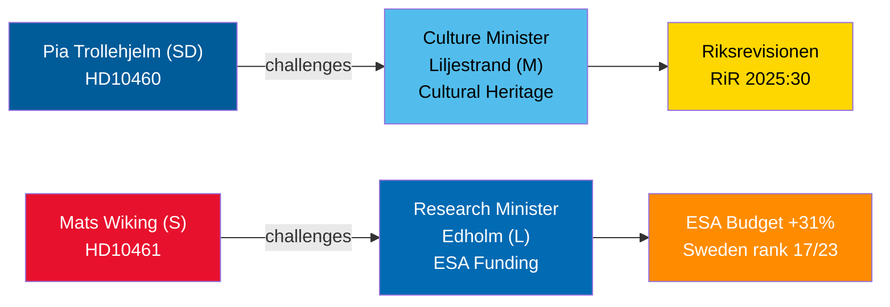

# 2026年4月30日质询辩论：文化遗产疏忽与瑞典太空撤退

**Author**: James Pether Sörling  
**Date**: 2026-04-30  
**Classification**: PUBLIC — GDPR Art 9(2)(e,g)  
**Confidence**: MEDIUM [B2]  

## 🎯 简报摘要

2026年4月29至30日提交的两份质询揭示了蒂多联合政府内部截然不同的治理缺陷：瑞典民主党（SD）要求联合政府伙伴、文化部长莉利耶斯特兰德（M）就国家补贴房产的推迟维护问题（国家审计局审计RiR 2025:30）承担责任；而反对党社会民主党人马茨·维京则就瑞典在欧洲航天局（ESA）资助方面的异常撤退向研究部长埃德霍尔姆（L）发出质疑——尽管2025年11月部长级会议上ESA预算创纪录增长31%，瑞典仍是仅有的三个削减贡献的ESA成员之一。两场辩论均将在2026年5月5日前安排，部长回应截止日期为2026年5月21日。

## 🧭 本简报支持的3项决策

1. **文化遗产投资组合管理者与公民社会**：监测莉利耶斯特兰德部长是否承诺对国家补贴房产进行全面维护调查并制定长期计划——这是申请欧盟遗产基金和吸引私营部门共同投资的前提条件。
2. **太空产业利益相关者与ESA合作伙伴**：评估埃德霍尔姆部长是否将宣布在下一个ESA部长级周期前进行修正性预算重新分配，以恢复瑞典在ESA计划中的份额，防止瑞典企业失去进入欧盟政府采购的资格。
3. **议会委员会主席（KU、UbU）**：两份质询均开启了正式监督窗口——KU：涉及联合政府内部对文化财产管理的责任；UbU：涉及航天领域研究与产业政策的协调一致性。

## 60秒情报要点

- 瑞典民主党的皮娅·特罗尔赫尔姆（质询HD10460）援引国家审计局审计RiR 2025:30，就国家不动产委员会（Statens fastighetsverk）的补贴房产向温和联合党的莉利耶斯特兰德施压——联合政府内部跨党派监督举措 [B2]
- 社会民主党的马茨·维京（HD10461）记录了瑞典在ESA中的排名下滑至17/23位，以及在自愿ESA项目中所占份额创历史新低，原因在于政府仅批准了Rymdstyrelens为2026年至2028年申请的1亿瑞典克朗（MSEK） [A2]
- 德国、法国、意大利、西班牙、波兰和加拿大在2025年11月的部长级会议上大幅增加了ESA贡献；瑞典仅与另外两个成员一起削减了份额 [A2]
- 两份质询均于2026-04-30转交给部长；辩论于2026-05-05公告；回复截止日期2026-05-21 [A1]
- 两份质询均未附有表决——它们仅是问责机制；对议会纪律的影响有限，但声誉压力显著 [B1]

## 主要前瞻指标

若埃德霍尔姆部长在9月瑞典政府预算谈判结束前未宣布任何ESA预算纠正措施，瑞典太空产业协会可能会公开升级此事，该问题或将在秋季研究政策法案中再度浮现。

## Mermaid概览

<!-- source-sha: 1f8ac3fadc3c7198b50f9e6519083702a0185cd8 -->
