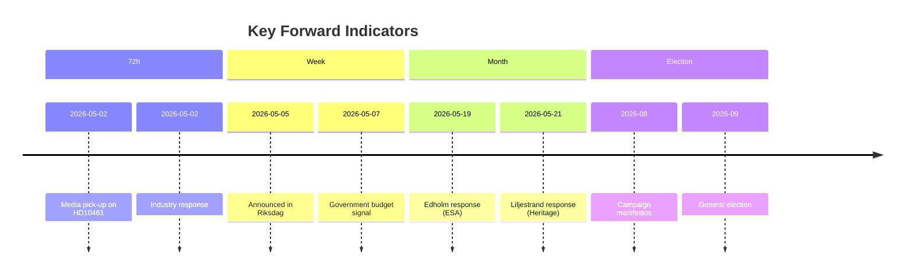

# Forward Indicators — Interpellations 30 April 2026

**Author**: James Pether Sörling  
**Date**: 2026-04-30  

## 72-Hour Horizon

| # | Date | Indicator | Signal |
|---|------|-----------|--------|
| 1 | 2026-05-01 to 2026-05-02 | Media coverage of HD10461 in DN/SvD/Aftonbladet | Pick-up = confirms ESA issue has public traction |
| 2 | 2026-05-01 to 2026-05-02 | Swedish space industry associations (SNSB, SpaceSWE) public reaction | Statement = confirms industry mobilisation |
| 3 | 2026-05-02 | Rymdstyrelsen public communication | Any statement referencing ESA budget = confirms issue is escalating |
| 4 | 2026-05-01 | Culture Ministry press team response query | Ministerial pre-positioning signal |

## One-Week Horizon

| # | Date | Indicator | Signal |
|---|------|-----------|--------|
| 5 | 2026-05-05 | Both interpellations announced (riksdag.se calendar) | Expected procedural confirmation |
| 6 | 2026-05-05 to 2026-05-08 | Follow-up by Mats Wiking (S) on social media or press | S amplifying ESA message = building election platform |
| 7 | 2026-05-07 | Government's spring budget communication | If ESA mentioned in fiscal frame = policy attention |
| 8 | 2026-05-08 | KU committee schedule — any SFV or heritage item | Committee interest = escalation signal for HD10460 |

## One-Month Horizon

| # | Date | Indicator | Signal |
|---|------|-----------|--------|
| 9 | 2026-05-19 | Minister Edholm's response to HD10461 | Commitment = policy pivot; deflection = escalation |
| 10 | 2026-05-21 | Minister Liljestrand's response to HD10460 | Commitment to survey = progress; no commitment = cycle repeats |
| 11 | 2026-05-21 | Parliamentary debate on both interpellations | Quality of debate = public salience indicator |
| 12 | 2026-05-25 to 2026-05-31 | Post-debate press coverage | Media framing of government response |
| 13 | 2026-06-01 | Riksdag session ends (approximate) | Legislative window closing — no further interpellation opportunity until autumn |

## Election Horizon (September 2026)

| # | Date | Indicator | Signal |
|---|------|-----------|--------|
| 14 | 2026-08-01 to 2026-09-01 | S election manifesto — space/ESA commitment? | If featured = HD10461 elevated to campaign issue |
| 15 | 2026-08-01 to 2026-09-01 | Government autumn budget — ESA supplementary? | If included = government pre-empts opposition attack |
| 16 | 2026-08-15 | Election campaign debate — research/space policy? | If raised = issue has mainstreamed |

