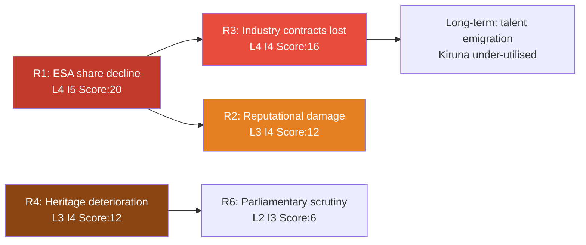

# Risk Assessment — Interpellations 30 April 2026

**Author**: James Pether Sörling  
**Date**: 2026-04-30  

## Risk Register (5-Dimension Framework)

| Risk ID | Category | Description | Likelihood (1-5) | Impact (1-5) | L×I Score | Confidence |
|---------|----------|-------------|-----------------|--------------|-----------|------------|
| R1 | Policy | Sweden's ESA share continues declining → industry loses EU procurement access | 4 | 5 | 20 | HIGH [B2] |
| R2 | Reputational | Sweden perceived as unreliable ESA/EU partner; NATO partners note space intelligence gap | 3 | 4 | 12 | MEDIUM [B3] |
| R3 | Economic | Swedish space firms lose contracts to German/French/Polish competitors due to ESA quota shortfall | 4 | 4 | 16 | HIGH [B2] |
| R4 | Heritage | Irreversible deterioration of state grant properties if no maintenance plan enacted | 3 | 4 | 12 | MEDIUM [B2] |
| R5 | Political | SD-M coalition friction escalates if cultural heritage debate produces no ministerial commitment | 2 | 3 | 6 | LOW [C3] |
| R6 | Institutional | Riksrevisionen findings on SFV ignored → future audit escalation to parliamentary scrutiny | 2 | 3 | 6 | LOW [C3] |

## Top Risk: R1 — ESA Programme Share Decline

**Description**: With Sweden's 2026–2028 ESA budget set at 100 MSEK (insufficient per Rymdstyrelsen), Swedish industry's share of mandatory and voluntary ESA programmes will remain at record lows. ESA programme shares directly gate EU public procurement eligibility under "geographical distribution" rules. Swedish aerospace SMEs competing for Copernicus, Galileo, and ARIANE programme sub-contracts face structural exclusion.

**Cascading chain**: Budget shortfall → reduced ESA programme share → fewer sub-contracts awarded to Swedish firms → revenue decline → talent emigration → Esrange becomes under-utilised → further ESA marginalisation.

**Posterior probability** (given government has already set 2026–2028 ESA budget): probability of meaningful corrective action in current budget cycle = 25% [B3]. Probability of corrective action in autumn 2026 supplementary budget = 40% [C3].

## Cascading Risk Map

