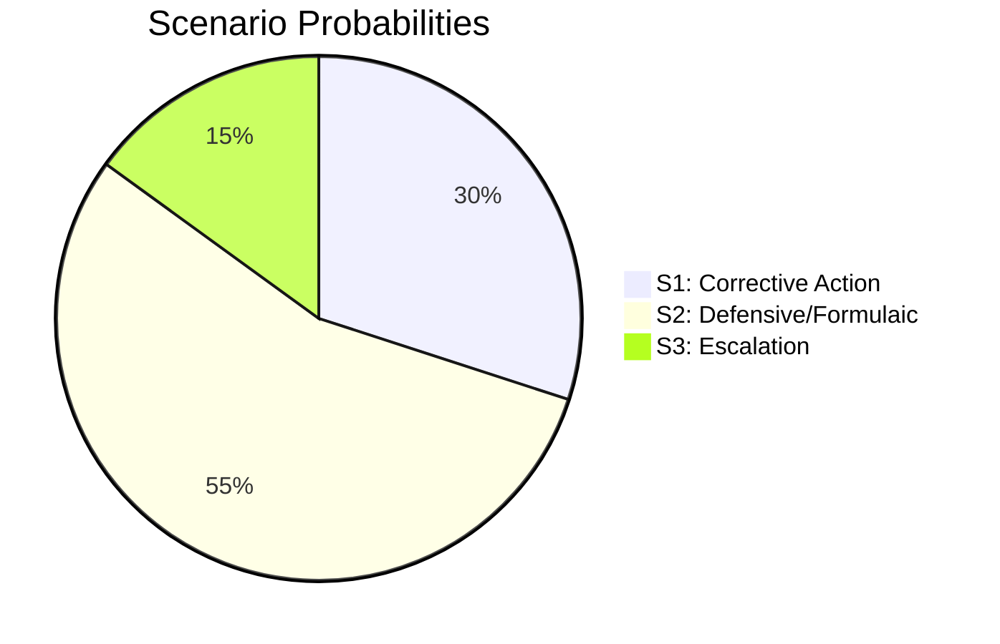

# Scenario Analysis — Interpellations 30 April 2026

**Author**: James Pether Sörling  
**Date**: 2026-04-30  

## Scenario Framework

Three scenarios evaluated for each interpellation's ministerial response window (deadline 21 May 2026).

### Scenario 1: Government Commits to Corrective Action (30% probability) [C3]

**Description**: Both ministers announce concrete commitments — Liljestrand commissions a SFV maintenance survey with a 2026 Q3 reporting date; Edholm announces supplementary ESA budget or a commitment to advocate for increased allocation in the autumn budget.

**Leading indicators**:
- Government press release before 19 May 2026 on space/ESA strategy update
- Culture Ministry commissions Statskontoret or SFV review of maintenance backlog
- Coalition partners publicly welcome the response

**Impact**: Risk R1, R4 reduced; no further escalation; HD10461 may become a positive case study for space cluster investments.

### Scenario 2: Ministerial Response is Defensive and Formulaic (55% probability) [B3]

**Description**: Ministers respond by citing existing policies, noting budget constraints, and making no new commitments. SD and S register dissatisfaction but take no further immediate procedural steps.

**Leading indicators**:
- Ministerial written responses reference prior decisions without new measures
- No committee hearing scheduled for either topic within 4 weeks
- Industry associations note response as inadequate but do not publicly escalate

**Impact**: Issues persist; risks R1, R3 materialise gradually; Heritage backlog continues; possible resurfacing in autumn budget debates.

### Scenario 3: Escalation — Committee Hearings or Formal Follow-Up (15% probability) [C3]

**Description**: One or both ministers' responses are judged so inadequate that the filing MP escalates — either through a follow-up written question, a committee hearing request, or an amendment in the autumn supplementary budget.

**Leading indicators**:
- SD's riksdag group explicitly distances from Liljestrand's response in media
- S tables amendments in UbU targeting ESA appropriation
- Rymdstyrelsen publicly reiterates the insufficiency of 100 MSEK allocation

**Impact**: Coalition strain for SD-M relationship; media pressure; potential ESA partner diplomatic démarche.

## Probability Summary

| Scenario | Probability | Confidence |
|----------|------------|------------|
| S1: Corrective Action | 30% | MEDIUM [C3] |
| S2: Defensive Response | 55% | MEDIUM [B3] |
| S3: Escalation | 15% | LOW [C3] |
| **Total** | **100%** | |

