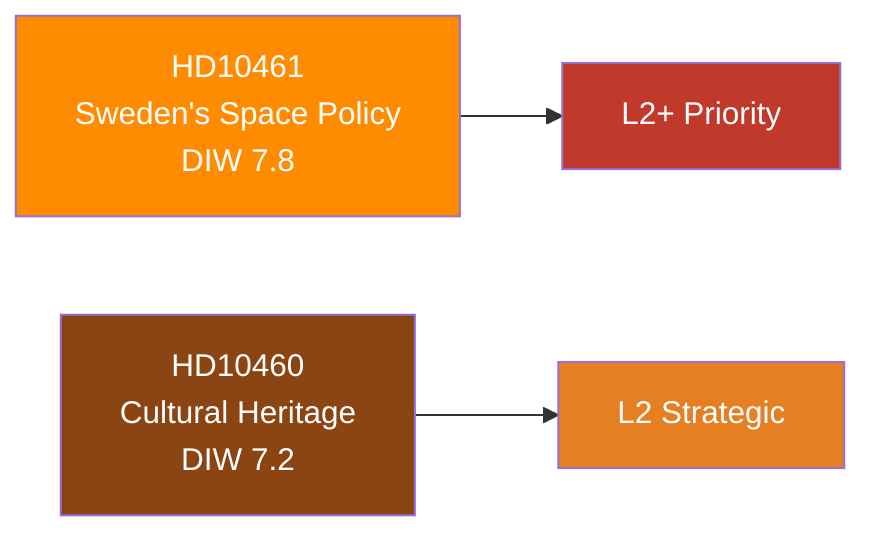

# Significance Scoring — Interpellations 30 April 2026

**Author**: James Pether Sörling  
**Date**: 2026-04-30  

## DIW Scores

| dok_id | Directness | Immediacy | Wideness | DIW Total | Tier |
|--------|-----------|----------|---------|-----------|------|
| HD10461 | 7 | 8 | 8 | 7.8 | L2+ Priority |
| HD10460 | 7 | 7 | 7 | 7.2 | L2 Strategic |

### HD10461 — Swedish Space Industry / ESA

- **Directness (7/10)**: Direct challenge on a specific quantifiable policy failure (ESA rank 17/23, 100 MSEK budget shortfall vs. Rymdstyrelsen request). Minister must respond on record.
- **Immediacy (8/10)**: ESA programme allocations for 2026–2028 are already locked; delay in correction compounds competitive disadvantage exponentially.
- **Wideness (8/10)**: Affects Swedish space industry (~5,000 employees), dual-use defence infrastructure (GPS/Galileo), EU public procurement eligibility, and Sweden's NATO interoperability signalling.

### HD10460 — Cultural Heritage / Grant Properties

- **Directness (7/10)**: Directly cites Riksrevisionen RiR 2025:30; demands a concrete government action (mapping + long-term plan).
- **Immediacy (7/10)**: Deferred maintenance compounds annually; heritage values are irreversible once lost.
- **Wideness (7/10)**: Affects Statens fastighetsverk portfolio, heritage tourism, UNESCO/EU Heritage designation prospects, and cultural sector employment.

## Sensitivity Analysis

| Variable | If higher | If lower |
|----------|----------|---------|
| Government response commitment | Reduced political risk; industry reassurance | Escalation to committee hearings |
| Media amplification | Opposition may merge into budget debate | Risk remains at committee level |
| ESA partner pressure | Diplomatic dimension added | Remains domestic |

## Mermaid Significance Diagram

