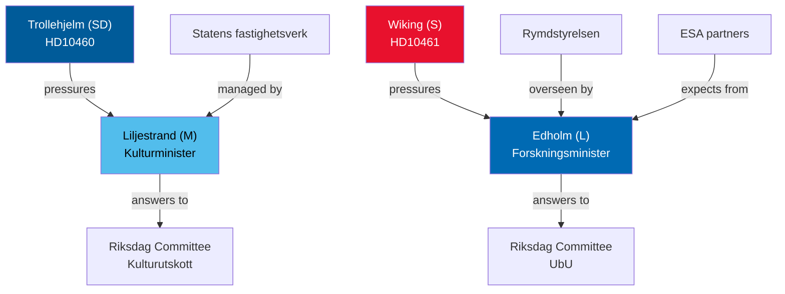

# Stakeholder Perspectives — Interpellations 30 April 2026

**Author**: James Pether Sörling  
**Date**: 2026-04-30  

## 6-Lens Stakeholder Matrix

### Lens 1: Filing MPs

| Actor | Party | Role | Objective | Expected Outcome |
|-------|-------|------|-----------|-----------------|
| Pia Trollehjelm | SD | Filer, HD10460 | Force culture minister to commit to heritage survey and maintenance plan [A1] | Formal ministerial record; political signalling to cultural sector voters |
| Mats Wiking | S | Filer, HD10461 | Expose government's ESA funding retreat; create political cost [A2] | Ministerial record, media coverage, industry support |

### Lens 2: Addressed Ministers

| Actor | Party | Ministry | Position | Constraint |
|-------|-------|----------|----------|------------|
| Parisa Liljestrand | M | Kulturminister | Must respond by 2026-05-21; RiR 2025:30 is on record | Budget constraints; coalition cohesion with SD |
| Lotta Edholm | L | Gymnasie-, högskole- och forskningsminister | Must explain ESA budget choice; 100 MSEK vs. Rymdstyrelsen request is public [A2] | Competing budget priorities; government fiscal envelope |

### Lens 3: Affected Agencies

| Agency | Relevance | Impact |
|--------|-----------|--------|
| Statens fastighetsverk (SFV) | Manages grant properties (HD10460) | Maintenance backlog confirmed by RiR 2025:30 |
| Rymdstyrelsen | Sweden's space agency (HD10461) | Budget request partially denied; reduced ESA programme shares |

### Lens 4: Industry Stakeholders

| Sector | Affected by | Concern |
|--------|-----------|---------|
| Swedish aerospace firms (OHB Sweden, AAC Clyde Space, RUAG Sweden) | HD10461 | ESA sub-contract eligibility; EU public procurement access |
| Heritage sector (museums, tourism, conservation NGOs) | HD10460 | SFV property condition; visiting public access |

### Lens 5: International Partners

| Actor | Relevance |
|-------|-----------|
| ESA member states | Sweden's reduced contribution affects internal burden-sharing perceptions |
| NATO partners | Satellite infrastructure (Galileo/Copernicus) is dual-use NATO/civilian |
| Nordic space cluster (Norway, Finland, Denmark) | HD10461 explicitly notes Sweden is behind all Nordic neighbours [A2] |

### Lens 6: Parliamentary Committees

| Committee | Relevance |
|-----------|-----------|
| Kulturutskottet | HD10460 heritage oversight |
| Utbildningsutskottet (UbU) | HD10461 research/space policy |
| Konstitutionsutskottet (KU) | Potential escalation if ministerial responses are inadequate |

## Influence Network

