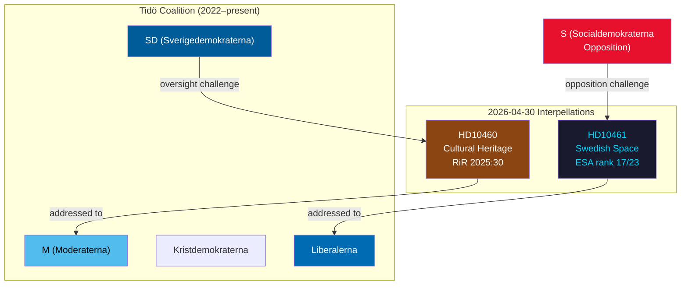

# Synthesis Summary — Interpellation Debates 30 April 2026

**Author**: James Pether Sörling  
**Date**: 2026-04-30  

## Lead Story

The 30 April 2026 interpellations reveal two distinct governance stress points within the Tidö coalition: first, an intra-coalition accountability challenge where SD uses Riksrevisionen's audit findings to hold M's culture minister responsible for the state's cultural heritage portfolio; second, a structural research-industrial policy gap where the government's ESA funding cuts leave Sweden an outlier in European space investment and risk eroding domestic industry competitiveness.

## DIW-Weighted Ranking

| dok_id | Title | DIW Score | Tier |
|--------|-------|-----------|------|
| HD10461 | Insatser för den svenska rymdbranschen | 7.8 | L2+ Priority |
| HD10460 | Statens kulturarv och bidragsfastigheternas underhåll | 7.2 | L2 Strategic |

**Weighting rationale**: HD10461 scores higher on national security and industrial competitiveness dimensions (space = dual-use infrastructure for defence and civilian navigation); HD10460 scores on heritage stewardship and Riksrevisionen compliance.

## Integrated Intelligence Picture

The two interpellations, while superficially distinct (culture vs. research), share a common analytical core: both challenge coalition ministries over documented shortfalls in public investment that were flagged by authoritative oversight bodies (Riksrevisionen for SFV grant properties; Rymdstyrelsen's own budget submission for ESA contributions). This pattern — opposition and intra-coalition actors citing audit or agency data to force ministerial accountability — is a structural feature of Swedish parliamentary oversight rather than an anomaly.

**Key analytical judgement**: The space interpellation (HD10461) carries higher strategic weight because it touches on dual-use infrastructure (satellite data for military C4ISR and civil navigation), EU single-market access (ESA programme quotas determine public procurement eligibility), and Sweden's NATO-aligned research posture. The cultural heritage interpellation (HD10460) is significant primarily as a display of SD's oversight function within the coalition — SD holding M accountable demonstrates the coalition's internal checks are operational, but the policy stakes are lower.

## Mermaid Policy Network

