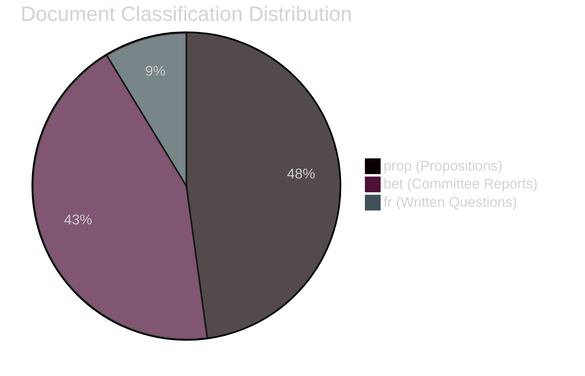
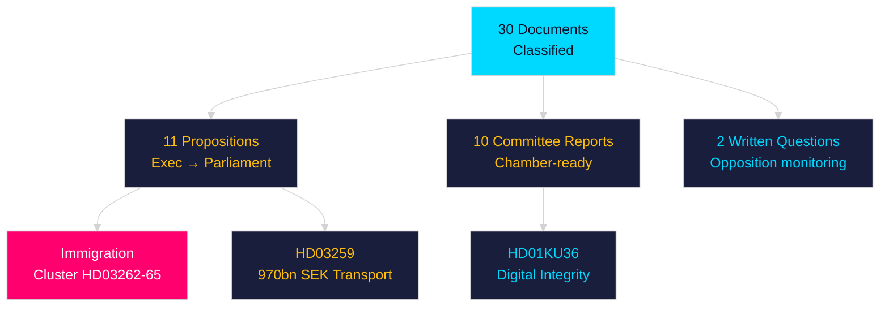

# Classification Results — Month Ahead May 2026

**Author**: James Pether Sörling | **Date**: 2026-04-30

## Classification Framework

7-dimension classification per document: (1) Policy Domain, (2) Political Salience, (3) Electoral Impact, (4) Implementation Complexity, (5) EU/International Dimension, (6) Security/Defence Dimension, (7) GDPR/Privacy Dimension

## Priority Tier Assignments

### Priority Tier 1 — Immediate Action

| dok_id | Domain | Salience | Electoral | Impl. | EU | Security | Privacy |
|--------|--------|----------|-----------|-------|-----|---------|---------|
| HD03259 | Infrastructure/Climate | Very High | Very High | Very High | High | Medium | Low |
| HD01KU36 | Governance/Digital | High | High | Medium | High | Low | Very High |
| HD03253 | Finance/Banking | Medium | Low | High | Very High | Low | Low |
| HD03252 | Justice/Welfare | High | Very High | High | Low | Low | Medium |

### Priority Tier 2 — Monitor

| dok_id | Domain | Salience | Electoral | Impl. | EU | Security | Privacy |
|--------|--------|----------|-----------|-------|-----|---------|---------|
| HD01JuU9 | Justice | Medium | Medium | High | Medium | Low | Medium |
| HD10461 | Research/Defence | High | Medium | Medium | High | High | Low |
| HD01NU22 | Competition | Medium | Low | High | Very High | Low | Low |
| HD10460 | Culture/Heritage | Medium | High | Medium | Low | Low | Low |

### Priority Tier 3 — Background

| dok_id | Domain | Salience |
|--------|--------|----------|
| HD11772 | Foreign policy/Aid | Medium |
| HD11774 | Housing | Medium |
| HD11769 | Health | Low |
| HD11768 | Animal welfare | Low |
| HD11771–HD11776 | Various | Low |

## Retention and Access

- All documents: PUBLIC under Offentlighetsprincipen (RF 2:1)
- GDPR Art. 9(2)(e)(g): Political opinions of named MPs in interpellation debates are publicly made statements
- Retention: 5 years for analysis artifacts; source documents permanent (Riksdag archive)
- Classification review: Quarterly

## Classification Diagram

