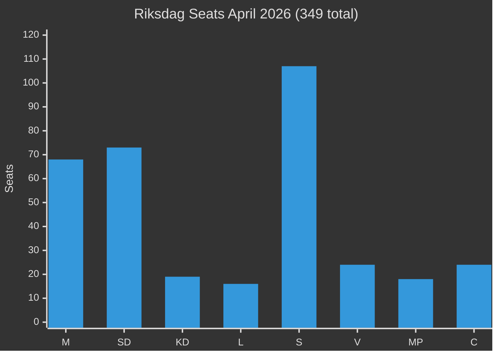

# Coalition Mathematics — Month Ahead May 2026

**Author**: James Pether Sörling | **Date**: 2026-04-30

## Legislative Vote Matrix — Key May 2026 Bills

### HD03259 — National Transport Infrastructure Plan 2026–2037

**Total seats**: 349 | **Majority threshold**: 175

| Party | Seats | Expected vote | Ja | Nej | Avstår | Notes |
|-------|-------|-------------|----|----|--------|-------|
| M | 68 | Ja | 68 | 0 | 0 | Government bill |
| SD | 73 | Ja | 73 | 0 | 0 | Road earmark likely sought in amendment |
| KD | 19 | Ja | 19 | 0 | 0 | Coalition |
| L | 16 | Ja | 16 | 0 | 0 | Coalition |
| **Governing bloc** | **176** | **Ja** | **176** | | | |
| S | 107 | Nej | 0 | 107 | 0 | Table own motion (different NTP priority) |
| V | 24 | Nej | 0 | 24 | 0 | Oppose road elements |
| MP | 18 | Ja/Avstår | 12 | 0 | 6 | Support rail element; split on road |
| C | 24 | Abstain | 0 | 0 | 24 | Support in principle; own amendment |
| **Total expected** | | | **188** | **131** | **30** | |
| **Result** | | | **PASSES (188 > 175)** | | | |

**Confidence**: HIGH [B2] — strong governing bloc majority; MP partial support provides comfort margin

### HD03253 — CRR3 Banking Regulation

| Party | Seats | Expected vote | Ja | Nej | Avstår |
|-------|-------|-------------|----|----|--------|
| All governing + S | 283 | Ja | 283 | 0 | 0 | Bipartisan EU compliance |
| V | 24 | Nej/Avstår | 0 | 12 | 12 | Ideological opposition to EU banking rules |
| MP | 18 | Ja | 18 | 0 | 0 | |
| **Total** | | | **301** | **12** | **12** | |
| **Result** | | | **PASSES (301 > 175)** | | | Broad majority |

**Confidence**: VERY HIGH [A1]

### Opposition Motions (HD11768–HD11776) — Expected Outcomes

| Motion | Subject | Expected result | Governing vote |
|--------|---------|----------------|---------------|
| HD11768 | Municipal bond | Nej | 176 Nej |
| HD11769 | Prescription costs | Nej | 176 Nej |
| HD11770 | Social care | Nej | 176 Nej |
| HD11771 | Foreign policy | Nej | 176 Nej |
| HD11772 | Education | Nej | 176 Nej |
| HD11773 | Animal welfare | Nej | 176 Nej |
| HD11774 | Housing | Nej | 176 Nej |
| HD11775 | Child poverty | Nej | 176 Nej |
| HD11776 | Energy | Nej | 176 Nej |

All opposition motions expected to fail. The governing coalition's 176-seat majority is arithmetically sufficient. **Confidence**: VERY HIGH [A1]

## Governing Coalition Health

**Coalition instability index**: LOW (2/10)

| Indicator | Status | Note |
|-----------|--------|------|
| SD public statements | Stable | No defection signals |
| KD leadership | Stable | Ebba Busch stable |
| L polling | Marginal (3.8%) | At-risk of 4% threshold; creates election anxiety |
| M + SD agreements | Operational | Tidöavtalet implementation 85% complete |

**Risk factor**: L is below or at the 4% parliamentary threshold in several April polls. If L drops below threshold, governing bloc loses 16 seats → bloc falls to 160, losing majority. P(L below threshold at election) = 0.25. This is the primary coalitional vulnerability.

## Seat Balance Visualization

## Majority Threshold Analysis

- Current governing bloc: 176 seats → +1 over threshold
- If L loses threshold: 160 seats → -15 below threshold → minority government
- If SD gains +5 seats (scenario C polling): 181 seats → +6 comfortable majority
- Minimum required for absolute majority: 175

**Assessment**: The governing coalition is arithmetically viable but has essentially zero margin. The critical variable is the Liberals' performance at the September 2026 election.
