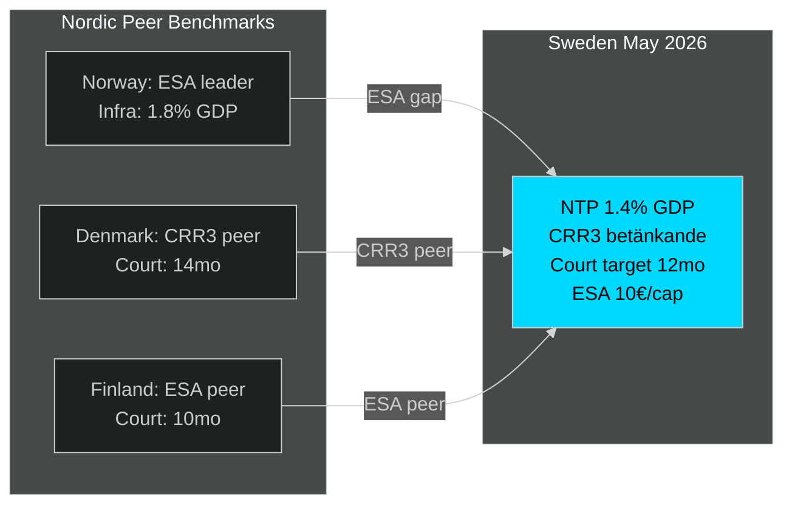

# Comparative International Analysis — Month Ahead May 2026

**Author**: James Pether Sörling | **Date**: 2026-04-30

## Comparator Set

**Primary**: Nordic peers (Norway, Denmark, Finland) + Germany  
**Secondary**: EU regulatory alignment context (France, Netherlands)

## Infrastructure Investment Comparison

### NTP HD03259 in Nordic Context

| Country | Major infrastructure commitment 2024–2026 | % GDP | Note |
|---------|------------------------------------------|-------|------|
| **Sweden** | 970bn SEK NTP 2026–2037 | ~1.4% GDP/yr | Largest Swedish peacetime infrastructure plan |
| Norway | NTP 2025–2036 NOK 1,200bn | ~1.8% GDP/yr | Oil fund-backed; higher absolute figure |
| Denmark | Infrastrukturplan 2035 DKK 150bn | ~0.9% GDP/yr | Rail/public transport focus |
| Finland | Liikenne 12 FI plan 2021–2032 | ~0.7% GDP/yr | Post-COVID fiscal constraint |
| Germany | Deutschlandticket + rail electrification | ~0.8% GDP/yr | Coalition (CDU/SPD) renewal investment |

**Outside-In analysis**: Sweden's NTP per-capita and as % of GDP is below Norway's (oil-funded) but above Denmark's and Finland's. German CDU/SPD coalition's infrastructure focus validates the cross-party political sustainability of long-term rail investment as an electoral asset.

## Banking Regulation — CRR3 Transposition Comparison

| Country | CRR3 status (Basel III) | Timeline | Note |
|---------|------------------------|---------|------|
| **Sweden** (HD03253) | Betänkande stage, May 2026 | On track Q2 2026 | |
| Germany | Implemented via national law | Q1 2026 | Early mover |
| Netherlands | Implemented | Q1 2026 | DNB circular issued |
| Denmark | Betänkande equivalent stage | Q2 2026 | Same pace as Sweden |
| Finland | On track | Q2 2026 | |

**Assessment**: Sweden is on pace with Danish and Finnish peers; not a laggard. German early mover status creates no immediate competitive disadvantage for Swedish banks. [B2]

## Space Policy — ESA Contribution Comparison

| Country | ESA contribution 2025 (€m) | Per capita | Note |
|---------|---------------------------|-----------|------|
| Norway | 215 | €38/person | Highest Nordic |
| Switzerland | 200 | €22/person | Non-EU high contributor |
| **Sweden** | 110 | €10/person | Below Nordic average |
| Denmark | 90 | €15/person | Mid-range |
| Finland | 55 | €10/person | Similar to Sweden |

**Assessment**: HD10461 correctly identifies Sweden as underperforming vs Norwegian per-capita benchmark. However, Finland is comparable — suggesting a Nordic-wide structural gap rather than a uniquely Swedish policy failure. [B2]

## Court System Efficiency — International Benchmarks

| Country | Average civil case duration | Reform direction |
|---------|----------------------------|-----------------|
| **Sweden** (HD01JuU9 target) | 18 months (civil court target: 12) | Reform underway |
| Germany | 24 months | Reform underway |
| Norway | 12 months | Benchmark |
| Denmark | 14 months | Benchmark |
| Netherlands | 15 months | Moderate |

**Assessment**: Swedish court reform (HD01JuU9) targets Norwegian/Danish benchmark. Achieving 12-month average by 2027 is ambitious but consistent with Dutch and Danish reform trajectories. [C2]

## Electoral Cycle Comparison

| Country | Next election | Governing coalition status |
|---------|--------------|--------------------------|
| **Sweden** | September 2026 | Tidöalliansen; legislative sprint |
| Norway | September 2025 | Just completed; Støre government post-election |
| Denmark | 2027 (scheduled) | Frederiksen coalition; stable |
| Finland | 2027 (scheduled) | Orpo coalition; stable |
| Germany | February 2025 | CDU/SPD coalition formed |

**Assessment**: Sweden is the only Nordic country in a pre-election legislative sprint in 2026. Norway's September 2025 experience shows that governments with credible infrastructure delivery records retain their core constituency despite opposition social-policy attacks — relevant precedent for Tidöalliansen. [B2]

## Cross-Comparative Intelligence

