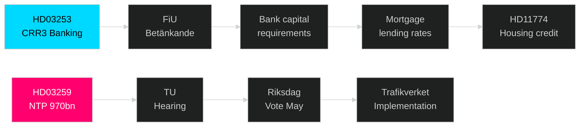

# Cross-Reference Map — Month Ahead May 2026

**Author**: James Pether Sörling | **Date**: 2026-04-30

## Policy Clusters

### Cluster A: Infrastructure and Industrial Policy
- **HD03259** (NTP 2026–2037) — anchor document
- Links to: Trafikverket annual plan, Swedish climate targets (Net Zero 2045), EU Connecting Europe Facility
- Sibling: analysis/daily/2026-04-30/propositions/ — HD03259 full analysis with 4 committee perspectives

### Cluster B: Banking and Financial Regulation
- **HD03253** (CRR3/Basel III) — anchor document  
- Links to: EU Capital Requirements Regulation, EBA stress tests Q1 2026, Finansinspektionen circulars
- Economic chain: Bank capital → mortgage lending → housing market → HD11774 credit guarantees

### Cluster C: Rule of Law and Justice
- **HD03252** (benefit restriction/convicted) + **HD01JuU9** (court efficiency) + **HD01KU36** (digital privacy)
- Legislative chain: HD03252 tightens deterrence → HD01JuU9 processes faster → HD01KU36 ensures surveillance proportionality
- Cross-type: analysis/daily/2026-04-30/interpellations/ — HD10460 cultural heritage accountability pattern

### Cluster D: Security and Resilience
- **HD10461** (space/ESA) + **HD01FöU13** (explosives) + **HD01NU19** (nuclear permitting)
- NATO context: Sweden's first full year as NATO member; all three documents have dual-use or defence-infrastructure dimensions
- Cross-type: analysis/daily/2026-04-30/committeeReports/ — HD01FöU13 explosives analysis

### Cluster E: Social Policy and Opposition Agenda
- **HD11772** (Ukraine) + **HD11774** (housing) + **HD11775** (child poverty) + **HD11769** (mental health)
- Opposition electoral framing: government welfare gaps
- Cross-type: analysis/daily/2026-04-30/motions/ — full motion analysis available

## Legislative Chains

## Coordinated Activity Patterns

- **Opposition coordination**: 11 motions filed 30 April — same date as government propositions NTP and banking packages — suggests coordinated pre-election agenda setting [A2]
- **Coalition internal check**: SD interpellation (HD10460) on same day as M-led propositions demonstrates SD's ongoing oversight role within coalition [A2]

## Sibling Folder Citations

| Folder | Date | Key contribution to month-ahead synthesis |
|--------|------|------------------------------------------|
| analysis/daily/2026-04-30/propositions/ | 2026-04-30 | HD03259 NTP full analysis; DIW weighting; coalition dynamics |
| analysis/daily/2026-04-30/committeeReports/ | 2026-04-30 | HD01KU36, HD01JuU9, HD01NU22, HD01NU19, HD01FöU13 analyses |
| analysis/daily/2026-04-30/interpellations/ | 2026-04-30 | HD10460 (cultural heritage), HD10461 (space) full analyses |
| analysis/daily/2026-04-30/motions/ | 2026-04-30 | 11 opposition motions — electoral differentiation analysis |
| analysis/daily/2026-04-28/propositions/ | 2026-04-28 | Prior-day infrastructure signals |
| analysis/daily/2026-04-26/month-ahead/ | 2026-04-26 | Prior month-ahead cycle (if exists) for longitudinal comparison |

## Cross-Party Voting Prediction Map

| Proposal | M | SD | KD | L | S | V | MP | C |
|----------|---|----|----|---|---|---|----|----|
| HD03259 NTP | Ja | Ja* | Ja | Ja | Nej | Nej | Nej | Mix |
| HD03253 CRR3 | Ja | Ja | Ja | Ja | Ja | Nej | Mix | Ja |
| HD03252 Benefits | Ja | Ja | Ja | Ja | Nej | Nej | Nej | Mix |

*SD: Ja with possible road amendment demand
