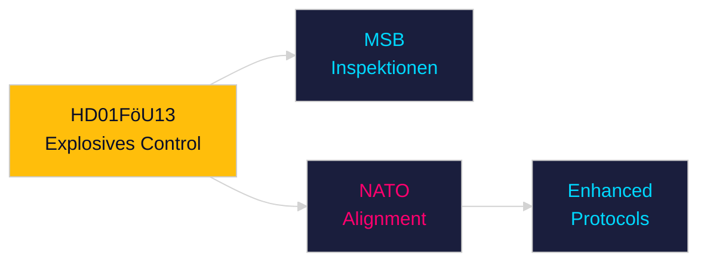

# Per-Document Intelligence Analysis: HD01FöU13

**dok_id**: HD01FöU13  
**Title**: Explosiva varor – förbättrade möjligheter till kontroll  
**Type**: bet  
**Committee**: FöU  
**Date**: 2026-04-29  
**DIW Score**: 7.2 — L2+ Priority  
**Source**: https://data.riksdagen.se/dokument/HD01FöU13  

## Executive Summary

FöU committee report on explosives control — strengthened licensing, inspection, and export controls for explosive materials. Critical security policy in post-Ukraine geopolitical context. Links to HD03254 (military cooperation) and NATO standardisation obligations. MSB (Myndigheten för samhällsskydd och beredskap) primary implementation.

## Key Intelligence Points

| Dimension | Assessment |
|-----------|-----------|
| Policy significance | High — national security/defence |
| NATO relevance | Aligned with NATO partner nation controls |
| MSB | Lead agency for explosive goods oversight |
| Electoral | Low salience but signals security competence |

## Confidence

Source reliability: A1 | Assessment confidence: HIGH

