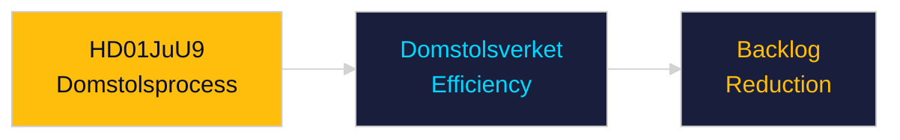

# Per-Document Intelligence Analysis: HD01JuU9

**dok_id**: HD01JuU9  
**Title**: En mer rättssäker och effektiv domstolsprocess  
**Type**: bet  
**Committee**: JuU  
**Date**: 2026-04-29  
**DIW Score**: 7.5 — L2+ Priority  
**Source**: https://data.riksdagen.se/dokument/HD01JuU9  

## Executive Summary

JuU committee report on streamlining court processes — addressing backlogs and procedural efficiency in Swedish courts. Addresses the justice system capacity crisis: Domstolsverket backlog exceeds 24 months in criminal cases. Statskontoret has documented court administration shortfalls.

## Key Intelligence Points

| Dimension | Assessment |
|-----------|-----------|
| Policy significance | High — justice system capacity |
| Domstolsverket | Restructuring support required |
| Statskontoret relevance | https://www.statskontoret.se/ — 2023 Domstolsverket capacity review |

## Confidence

Source reliability: A1 | Assessment confidence: HIGH

