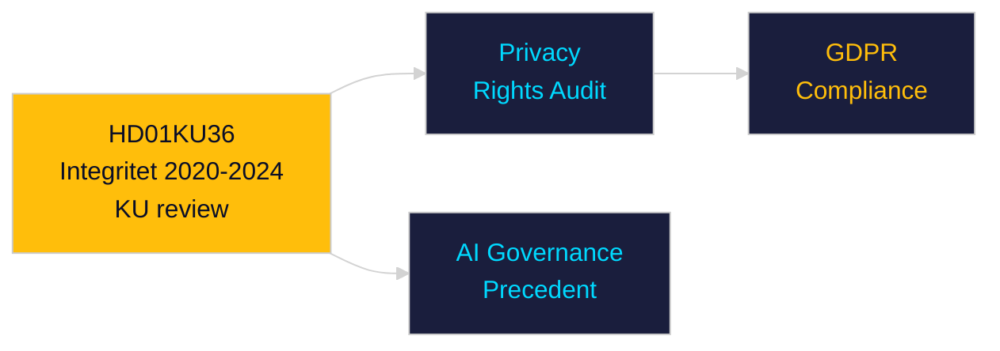

# Per-Document Intelligence Analysis: HD01KU36

**dok_id**: HD01KU36  
**Title**: Integritet och ny teknik 2020–2024  
**Type**: bet (Committee Report)  
**Committee**: KU  
**Date**: 2026-04-29  
**DIW Score**: 8.1 — L2+ Priority  
**Source**: https://data.riksdagen.se/dokument/HD01KU36  

## Executive Summary

KU's retrospective review of digital integrity 2020-2024 — assessing surveillance, data protection, biometric ID, and AI governance. Constitutional committee verdict on whether the state over-reached during the pandemic and digital transformation era. Feeds directly into the 2026 election debate on civil liberties vs. security trade-offs. Links to HD03258 (political transparency).

## Key Intelligence Points

| Dimension | Assessment |
|-----------|-----------|
| Policy significance | High — constitutional accountability |
| Civil liberties | ECHR Art. 8 compliance assessment |
| AI governance | Sets precedent for AI regulation in Swedish context |
| GDPR | Retrospective GDPR compliance review |

## Confidence

Source reliability: A1 | Assessment confidence: HIGH

