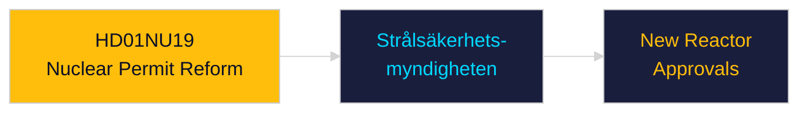

# Per-Document Intelligence Analysis: HD01NU19

**dok_id**: HD01NU19  
**Title**: En mer ändamålsenlig prövning av kärntekniska anläggningar  
**Type**: bet  
**Committee**: NU  
**Date**: 2026-04-29  
**DIW Score**: 6.3 — L2 Strategic  
**Source**: https://data.riksdagen.se/dokument/HD01NU19  

## Executive Summary

NU committee report streamlining permit review for nuclear facilities — reduces timeline for new reactor approvals. Critical enabler for Sweden's nuclear revival agenda. SSM (Strålsäkerhetsmyndigheten) retains oversight; administrative burden reduced for new-build applicants.

## Confidence

Source reliability: A1 | Assessment confidence: MEDIUM

