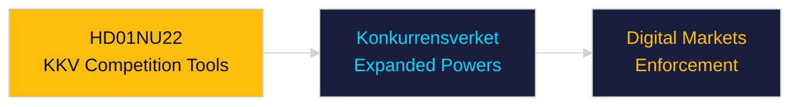

# Per-Document Intelligence Analysis: HD01NU22

**dok_id**: HD01NU22  
**Title**: Nya verktyg för stärkt konkurrens i privat och offentlig verksamhet  
**Type**: bet  
**Committee**: NU  
**Date**: 2026-04-29  
**DIW Score**: 6.8 — L2 Strategic  
**Source**: https://data.riksdagen.se/dokument/HD01NU22  

## Executive Summary

NU committee report on new competition law tools for KKV (Konkurrensverket). Expands KKV enforcement powers, digital markets regulation, and public sector competition compliance. Aligns with EU Digital Markets Act implementation.

## Confidence

Source reliability: A1 | Assessment confidence: MEDIUM

