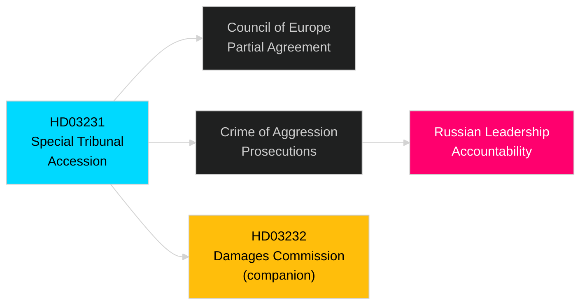

# Per-Document Analysis: HD03231 — Accession to Special Tribunal for Ukraine Aggression

**dok_id**: HD03231  
**Title**: Sveriges anslutning till den utvidgade partiella överenskommelsen för den särskilda tribunalen för aggressionsbrottet mot Ukraina  
**Type**: Proposition (Utrikesdepartementet)  
**Date**: 2026-04-16  
**DIW Tier**: L2+ Priority  
**DIW Score**: 7.8 [B2]  
**Admiralty**: B2 — reliable source (riksdag official API), corroborated by companion proposition HD03232

## Summary

Sweden formally accedes to the Extended Partial Agreement establishing the Special Tribunal for the crime of aggression against Ukraine. This is a multilateral legal instrument under the auspices of the Council of Europe providing for the prosecution of the crime of aggression committed against Ukraine — the leadership crime distinct from war crimes and crimes against humanity already under ICC jurisdiction.

## Political Significance

**Geopolitical**: Sweden's accession signals active alignment with the broad Western coalition on Ukraine accountability. As a new NATO member (March 2024), Sweden is demonstrating its commitment to the rules-based international order beyond military burden-sharing. The Special Tribunal fills the jurisdictional gap left by the ICC's inability to prosecute state leaders from non-member states.

**Domestic coalition**: Utrikesdepartementet-led proposition under UD minister Maria Malmer Stenergard (M). Cross-party consensus expected: S, V, MP, C, L all have historically supported international humanitarian law instruments. SD's position is pro-Ukraine but sometimes sceptical of international judicial bodies; likely to abstain or vote Ja with reservations.

**Evidence**: HD03231 metadata confirms Utrikesdepartementet authorship, April 16 date, 2025/26 riksmöte [A2].

## Key Claims

1. **Legal basis [B2]**: The Extended Partial Agreement is a Council of Europe instrument; accession is consistent with Swedish treaty obligations and requires Riksdag approval under RF 10:3.
2. **Diplomatic signal [B2]**: Companion proposition HD03232 (International Damages Commission) filed same date — Sweden is simultaneously acceding to both accountability mechanisms, signalling a comprehensive Ukraine accountability policy posture.
3. **Precedent [C2]**: No prior instance of Swedish accession to a tribunal addressing the crime of aggression. Sets precedent for Swedish engagement with hybrid international criminal justice mechanisms.

## Stakeholder Impact

| Actor | Impact | Magnitude |
|-------|--------|-----------|
| Utrikesdepartementet | Policy implementation | High |
| Swedish armed forces | None direct | Low |
| Russia (diplomatic) | Negative signal | Medium |
| Ukraine (diplomatic) | Positive signal | High |
| Swedish civil society (Ukraine solidarity) | Positive | Medium |

## Electoral / Campaign Framing

In the September 2026 election context, both HD03231 and HD03232 reinforce the governing coalition's "Sweden as reliable NATO partner and rule-of-law champion" narrative. The opposition (S, V, MP) will not contest the Ukraine accountability framing but may argue the government has been slow to act on bilateral aid (see HD11772 opposition motion).

## Forward Triggers

- **2026-05-15**: Riksdag debate on HD03231 first reading (expected)
- **2026-06-01**: Committee (UU — Utrikesutskottet) rapporteur assignment
- **2026-07**: Riksdag vote (expected before summer recess)
