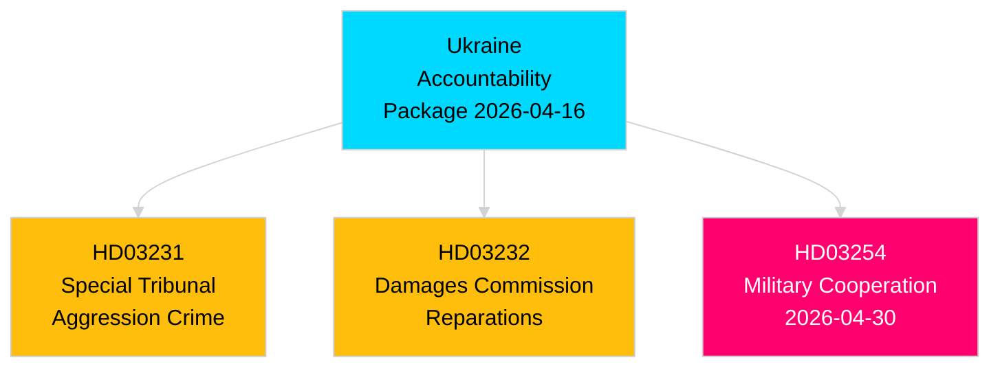

# Per-Document Analysis: HD03232 — Accession to International Damages Commission for Ukraine

**dok_id**: HD03232  
**Title**: Sveriges tillträde till konventionen om inrättande av en internationell skadeståndskommission för Ukraina  
**Type**: Proposition (Utrikesdepartementet)  
**Date**: 2026-04-16  
**DIW Tier**: L2+ Priority  
**DIW Score**: 7.6 [B2]  
**Admiralty**: B2 — reliable source (riksdag official API), corroborated by companion proposition HD03231

## Summary

Sweden accedes to the convention establishing an international damages register and compensation commission for Ukraine. This mechanism creates a legal framework for eventual reparations to Ukraine from Russia — tracking war damage claims and establishing the architecture for post-war compensation. Filed on the same date as HD03231 (Special Tribunal), constituting a coordinated dual-track Ukraine accountability policy.

## Political Significance

**Legal architecture**: The International Damages Commission operates distinctly from the Special Tribunal (HD03231): the Tribunal addresses individual criminal liability (crime of aggression); the Commission addresses state civil liability (reparations for war damage). Together they represent the full accountability spectrum.

**Fiscal implications**: Sweden's accession involves contributing to the operational costs of the Commission. Budgetary impact is modest in the short term (contribution scale linked to Sweden's Council of Europe assessment). Long-term fiscal exposure depends on reparations enforcement mechanisms.

**Evidence**: HD03232 metadata: Utrikesdepartementet, Maria Malmer Stenergard (M), April 16 2026 [A2]. Companion analysis: HD03231-analysis.md.

## Key Claims

1. **Multilateral framework [B2]**: Convention is a Council of Europe-hosted instrument with broad European signatory base. Sweden's accession maintains its position as active multilateral partner.
2. **Post-war planning signal [B2]**: The Commission's mandate extends into post-hostilities reconstruction — Sweden's accession signals long-term engagement with Ukraine's recovery.
3. **NATO alignment [C2]**: Combined with HD03254 (military cooperation) and HD03254 signed same month, Sweden is building a comprehensive Ukraine policy across military, legal, and reparations dimensions.

## Stakeholder Impact

| Actor | Impact | Magnitude |
|-------|--------|-----------|
| Finansdepartementet | Budget contribution (minor) | Low-Medium |
| Utrikesdepartementet | Implementation responsibility | Medium |
| Swedish business (Ukraine reconstruction) | Potential future opportunity | Low |
| Russia (diplomatic) | Strongly negative | High |

## Cross-Reference

See HD03231-analysis.md for the companion Special Tribunal proposition. The two together constitute Sweden's comprehensive Ukraine accountability package of April 2026.

## Forward Triggers

- **2026-05-15**: UU committee rapporteur assignment for HD03232
- **2026-06-30**: Expected Riksdag vote (before summer recess)
- **2026-Q3/Q4**: Commission begins registering damage claims; Swedish contribution to first operational budget
