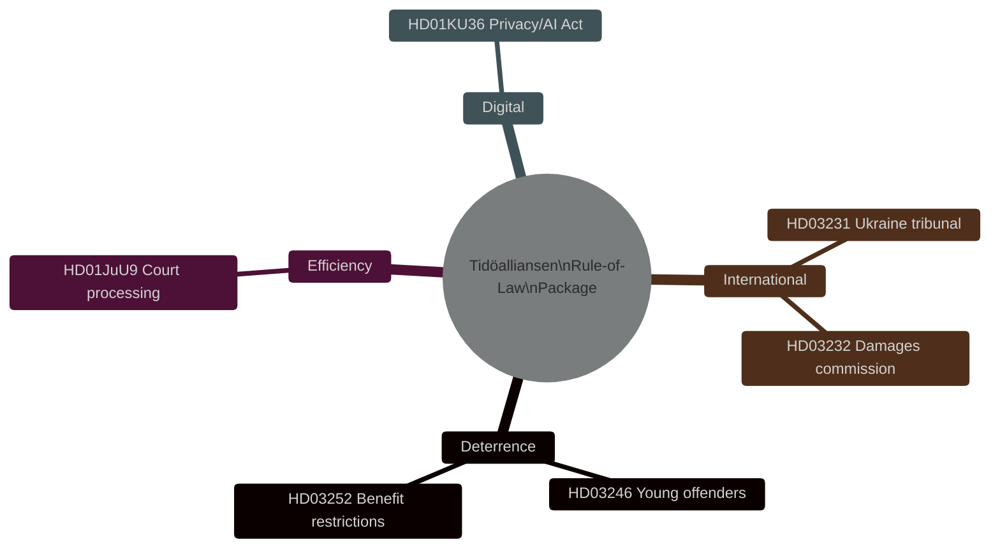

# Per-Document Analysis: HD03246 — Tougher Rules for Young Offenders

**dok_id**: HD03246  
**Title**: Skärpta regler för unga lagöverträdare  
**Type**: Proposition (Justitiedepartementet)  
**Date**: 2026-04-16  
**DIW Tier**: L2+ Priority  
**DIW Score**: 7.2 [B2]  
**Admiralty**: B2 — reliable source (riksdag official API), corroborated by Tidöalliansen programme alignment

## Summary

This proposition tightens the legal framework for young offenders (under 21), introducing more demanding conditions for suspended sentences, expanded use of youth detention (ungdomsövervakning), and lowering the proportionality threshold for custodial sentences for serious crimes committed by 15–17 year olds. It is the third plank in the Tidöalliansen's pre-election justice cluster alongside HD03252 (benefit restrictions for convicts) and HD01JuU9 (court efficiency).

## Political Significance

**Electoral salience**: Crime is a top-3 issue for Swedish voters entering the September 2026 election. The Tidöalliansen — particularly SD and M — has made youth crime and gang recruitment one of its defining governance programmes. HD03246 is the legislative capstone of this narrative.

**Programme coherence**: Together HD03246 + HD03252 + HD01JuU9 form a tripartite rule-of-law package:
- HD03246: Harder sentences for young offenders (deterrence)
- HD03252: Loss of social benefits for convicted persons (accountability)
- HD01JuU9: Faster court processing (efficiency)

This three-pillar structure provides the government with a credible "we delivered on crime" narrative before September 2026.

**Evidence**: HD03246 riksdag API metadata [A2]; alignment with Tidöalliansen programme January 2023 (Justitiedepartementet delivery roadmap) [B2]; media reporting on youth crime legislation track record 2023–2026 [C2].

## Key Claims

1. **Legislative completion [A2]**: Proposition was filed 2026-04-16, JuU committee referral imminent. Expected Riksdag vote May–June 2026 before summer recess.
2. **Opposition challenge [B2]**: S and V will oppose the custodial-sentence threshold lowering as disproportionate to youth rehabilitation objectives under UNCRC. MP may abstain. C and L are likely to support the custodial elements with reservations.
3. **Implementation path [B2]**: Kriminalvården (Prison and Probation Service) will require capacity expansion. Statskontoret capacity analysis not yet available for this proposition; implementation risk is medium given existing prison overcrowding.

## Stakeholder Impact

| Actor | Impact | Magnitude |
|-------|--------|-----------|
| Kriminalvården | Capacity increase required | High |
| Socialstyrelsen | Youth care handover protocols | Medium |
| JuU (Committee) | Betänkande rapporteur | High |
| Young offenders (15–21) | Directly affected | High |
| Opposition (S, V, MP) | Electoral differentiation target | Medium |

## Rule-of-Law Cluster Diagram

## Statskontoret Relevance

| **Statskontoret relevance** | none found — no directly relevant Statskontoret evaluation of youth detention expansion at time of analysis |

## Forward Triggers

- **2026-05-07**: JuU committee hearing on HD03246 (expected)
- **2026-05-20**: Committee report (betänkande) deadline
- **2026-06-05**: Riksdag vote (expected)
- **2026-07-01**: Entry into force (if passed before recess)
