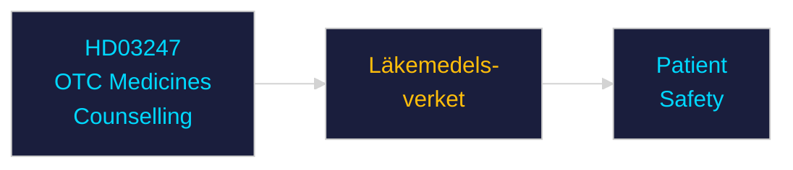

# Per-Document Intelligence Analysis: HD03247

**dok_id**: HD03247  
**Title**: Receptfria läkemedel med krav på särskild rådgivning  
**Type**: prop  
**Committee**: Socialdepartementet  
**Date**: 2026-04-28  
**DIW Score**: 4.5 — L1 Surface  
**Source**: https://data.riksdagen.se/dokument/HD03247  

## Executive Summary

Regulation of OTC medicines requiring special pharmaceutical counselling — updates dispensing rules for high-risk OTC drugs. Läkemedelsverket implementation. Low political significance; technical health policy.

## Confidence

Source reliability: A1 | Assessment confidence: MEDIUM

