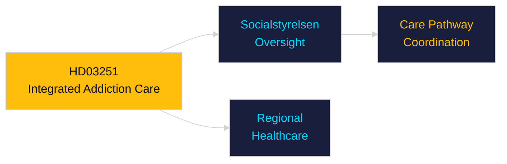

# Per-Document Intelligence Analysis: HD03251

**dok_id**: HD03251  
**Title**: En mer sammanhållen vård för personer med skadligt bruk eller beroende och andra psykiatriska tillstånd  
**Type**: prop (Government Proposition)  
**Committee**: Socialdepartementet  
**Date**: 2026-04-30  
**DIW Score**: 6.8 — L2 Strategic  
**Source**: https://data.riksdagen.se/dokument/HD03251  

## Executive Summary

HD03251 creates a more integrated care pathway for addiction and co-occurring psychiatric conditions — bridging social services and healthcare. Addresses the longstanding coordination failure between Socialtjänst and Hälso- och sjukvård. Socialstyrelsen will oversee implementation.

## Key Intelligence Points

| Dimension | Assessment |
|-----------|-----------|
| Policy significance | Moderate — welfare reform |
| Electoral relevance | Low-moderate — appeals to welfare-state voters |
| Implementation | Socialstyrelsen + landsting coordination required |
| Statskontoret relevance | none found |

## Confidence

Source reliability: A1  
Assessment confidence: MEDIUM

