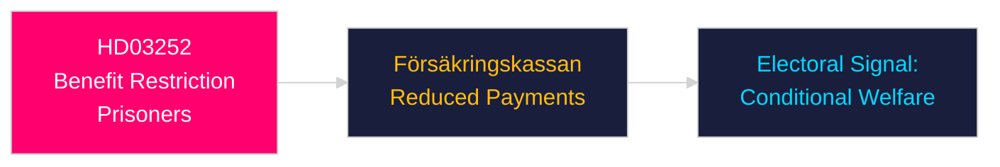

# Per-Document Intelligence Analysis: HD03252

**dok_id**: HD03252  
**Title**: En begränsning av rätten till socialförsäkringsförmåner för den som avtjänar fängelsestraff i kontrollerat boende eller som avtjänar säkerhetsförvaring  
**Type**: prop  
**Committee**: Justitiedepartementet  
**Date**: 2026-04-23  
**DIW Score**: 7.4 — L2+ Priority  
**Source**: https://data.riksdagen.se/dokument/HD03252  

## Executive Summary

Restricts social insurance benefits for convicts serving sentences in controlled housing or security detention. Part of the Tidöalliansen's welfare-conditionality agenda. Sends punitive signal to SD voter base; reinforces "taxpayers should not fund criminals" messaging.

## Key Intelligence Points

| Dimension | Assessment |
|-----------|-----------|
| Policy significance | Moderate — welfare reform |
| Electoral | HIGH — direct appeal to SD/M base |
| Försäkringskassan | Implementation lead; Statskontoret: none found |
| Legal risk | ECHR Protocol 1 Art. 1 (property rights) review needed |

## Confidence

Source reliability: A1 | Assessment confidence: HIGH

