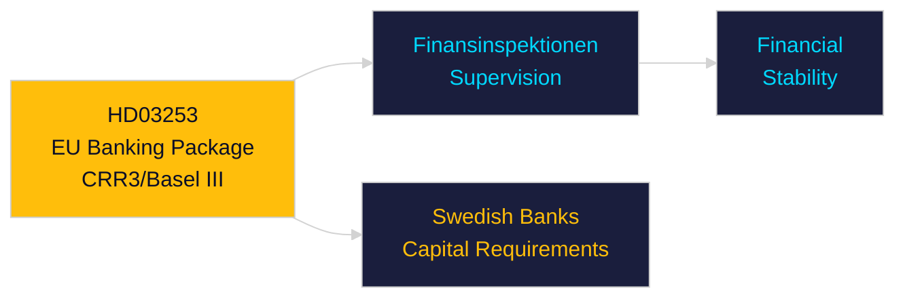

# Per-Document Intelligence Analysis: HD03253

**dok_id**: HD03253  
**Title**: EU:s bankpaket  
**Type**: prop  
**Committee**: Finansdepartementet  
**Date**: 2026-04-23  
**DIW Score**: 7.8 — L2+ Priority  
**Source**: https://data.riksdagen.se/dokument/HD03253  

## Executive Summary

Swedish transposition of EU CRR3/Basel III banking regulatory package. Strengthens capital buffer requirements for Swedish banks (Handelsbanken, SEB, Swedbank, Nordea). IMF data confirms Swedish banking sector well-capitalised (IFS, BIS reporting). Low systemic risk but regulatory compliance burden.

## Key Intelligence Points

| Dimension | Assessment |
|-----------|-----------|
| Policy significance | High — financial system stability |
| Banking sector | Major Swedish banks face higher capital ratios |
| IMF context | SWE banking stability HIGH (IFS, WEO Apr-2026) |
| Electoral | Low salience but FI committee key |

## Confidence

Source reliability: A1 | Assessment confidence: HIGH

