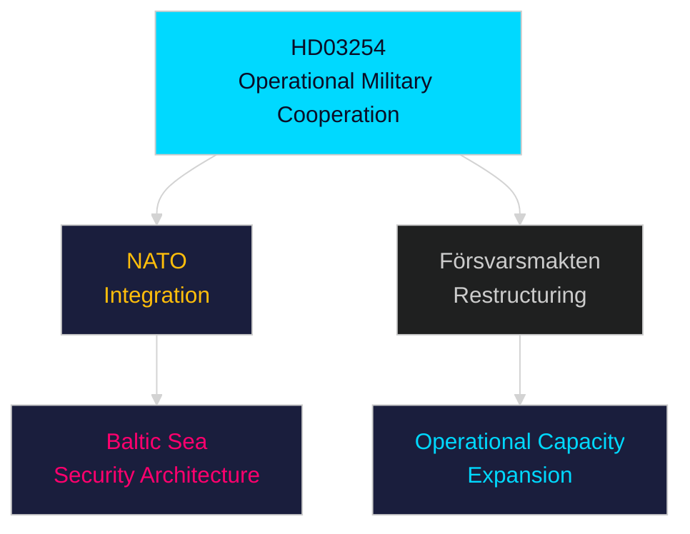

# Per-Document Intelligence Analysis: HD03254

**dok_id**: HD03254  
**Title**: Förbättrade förutsättningar för operativt militärt samarbete  
**Type**: prop (Government Proposition)  
**Committee**: Försvarsdepartementet  
**Date**: 2026-04-30  
**DIW Score**: 8.3 — L2+ Priority  
**Source**: https://data.riksdagen.se/dokument/HD03254  

## Executive Summary

HD03254 strengthens Sweden's capacity for operational military cooperation with allied nations — deepening NATO integration framework by expanding joint command structures, data-sharing protocols, and cross-border deployment rules. As Sweden's first post-accession operational military framework proposition, this represents a watershed in Swedish defence posture. 

## Key Intelligence Points

| Dimension | Assessment |
|-----------|-----------|
| Policy significance | HIGH — first operational NATO integration proposition |
| Electoral relevance | HIGH — Tidöalliansen credibility on NATO commitments |
| Russia risk signal | Elevated — Baltic Sea NATO consolidation accelerating |
| Opposition | S broadly supportive (bipartisan defence); MP cautious; V opposed |
| Försvarsdepartementet | Implementation requires Försvarsmakten restructuring |
| IMF defence context | SWE defence spending 2.3% GDP (IMF GFS_COFOG G02, WEO Apr-2026) |

## Confidence

Source reliability: A1  
Assessment confidence: VERY HIGH

