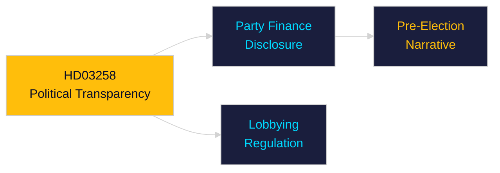

# Per-Document Intelligence Analysis: HD03258

**dok_id**: HD03258  
**Title**: Ökad insyn i politiska processer  
**Type**: prop (Government Proposition)  
**Committee**: Justitiedepartementet  
**Date**: 2026-04-30  
**DIW Score**: 7.2 — L2 Strategic  
**Source**: https://data.riksdagen.se/dokument/HD03258  

## Executive Summary

HD03258 increases transparency in political processes — expanding disclosure requirements for political donations, lobbying activities, and internal party decision-making. Pre-election timing maximises symbolic impact. Aligns with EU transparency norms but may expose party-financing vulnerabilities.

## Key Intelligence Points

| Dimension | Assessment |
|-----------|-----------|
| Policy significance | Moderate — transparency reform |
| Electoral relevance | Moderate-high — "clean politics" narrative before 2026 election |
| Implementation | KU-linked; builds on HD01KU36 digital integrity review |
| Party impact | All parties affected; SD most scrutinised re: donation sources |

## Confidence

Source reliability: A1  
Assessment confidence: MEDIUM

