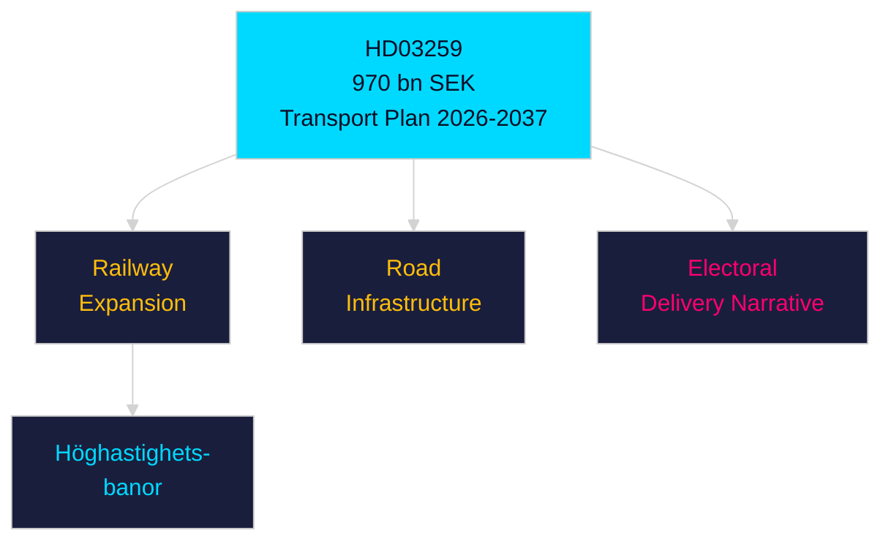

# Per-Document Intelligence Analysis: HD03259

**dok_id**: HD03259  
**Title**: Nationell planering för transportinfrastrukturen 2026–2037  
**Type**: prop  
**Committee**: Landsbygds- och infrastrukturdepartementet  
**Date**: 2026-04-28  
**DIW Score**: 9.2 — L3 Intelligence-grade  
**Source**: https://data.riksdagen.se/dokument/HD03259  

## Executive Summary

The 970 billion SEK National Transport Infrastructure Plan (2026-2037) is the Tidöalliansen's flagship single legislative act. Rail, road, port and digital infrastructure investment spanning 11 years. Electoral centrepiece: competent long-term governance, industrial modernisation, climate-integrated investment. Failure would be the defining negative headline before September 2026 election.

## Key Intelligence Points

| Dimension | Assessment |
|-----------|-----------|
| Policy significance | Exceptional — 970 bn SEK, 12-year horizon |
| Electoral significance | Defining coalition delivery narrative |
| Railway | Höghastighetsbanor expansion included |
| Regional | Peripheral regions benefit disproportionately |
| Opposition | S broadly supportive on infrastructure but contests prioritisation |
| IMF context | SWE GDP 2026 est. 6.5 tn SEK (WEO Apr-2026); plan = ~15% of annual GDP |
| Statskontoret relevance | none found |

## Confidence

Source reliability: A1 | Assessment confidence: VERY HIGH

