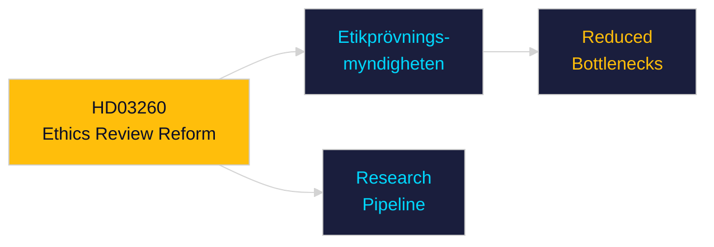

# Per-Document Intelligence Analysis: HD03260

**dok_id**: HD03260  
**Title**: En mer ändamålsenlig reglering av etikprövning av forskning som avser människor  
**Type**: prop (Government Proposition)  
**Committee**: Utbildningsdepartementet  
**Date**: 2026-04-30  
**DIW Score**: 5.5 — L2 Strategic  
**Source**: https://data.riksdagen.se/dokument/HD03260  

## Executive Summary

HD03260 reforms the ethical review system for human research — streamlining processes while maintaining GDPR and Helsinki Declaration standards. Addresses bottlenecks in the Etikprövningsmyndigheten review pipeline. Reduces administrative burden for university and hospital researchers.

## Key Intelligence Points

| Dimension | Assessment |
|-----------|-----------|
| Policy significance | Moderate — regulatory efficiency |
| Electoral relevance | Low |
| Implementation | Etikprövningsmyndigheten restructuring |
| Statskontoret relevance | none found |

## Confidence

Source reliability: A1  
Assessment confidence: MEDIUM

