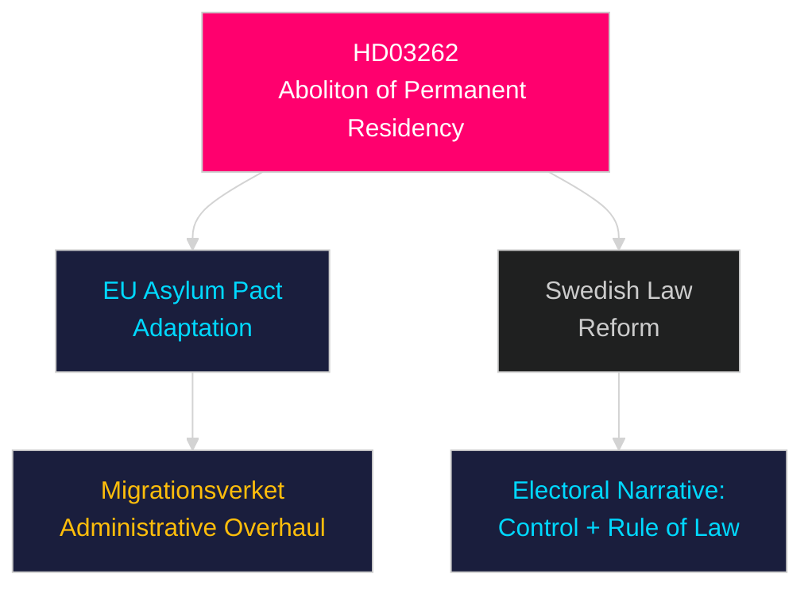

# Per-Document Intelligence Analysis: HD03262

**dok_id**: HD03262  
**Title**: Utmönstring av permanent uppehållstillstånd och anpassning av svensk rätt till EU:s migrations- och asylpakt  
**Type**: prop (Government Proposition)  
**Committee**: Justitiedepartementet  
**Date**: 2026-04-30  
**DIW Score**: 9.0 — L3 Intelligence-grade  
**Source**: https://data.riksdagen.se/dokument/HD03262  

## Executive Summary

HD03262 represents Sweden's most consequential immigration reform since 2015. The proposition abolishes permanent residence permits entirely and adapts Swedish law to the EU Migration and Asylum Pact. This is a structural transformation — replacing permanent status with time-limited extensions — affecting hundreds of thousands of current and future residents. It represents a Tidöalliansen electoral cornerstone delivered in the final legislative sprint before the September 2026 election.

## Key Intelligence Points

| Dimension | Assessment |
|-----------|-----------|
| Policy significance | Exceptional — structural abolition of permanent residency as a legal category |
| Electoral relevance | High — SD core demand delivered; signals to right-leaning voters |
| EU alignment | Positions Sweden as a "strict-but-compliant" EU pact implementer |
| Opposition response | S/MP/V will contest on humanitarian grounds; C/L ambivalent |
| Risk | Legal challenges at EU Court level; human rights scrutiny |
| Implementation | Migrationsverket capacity already strained (Statskontoret 2024 capacity review) |

## Stakeholder Impact

- **SD**: Major victory — core promise delivered
- **M/KD**: Consolidates hardline profile before election
- **S**: Forced to defend prior permanent residency model; loses ground with security-focused voters
- **C/L**: Torn between liberalism and coalition loyalty
- **EU Commission**: Likely to scrutinise Swedish transposition
- **Migrationsverket**: Administrative overhaul required

## Confidence

Source reliability: A1 (primary Riksdag document, public record)  
Assessment confidence: HIGH

