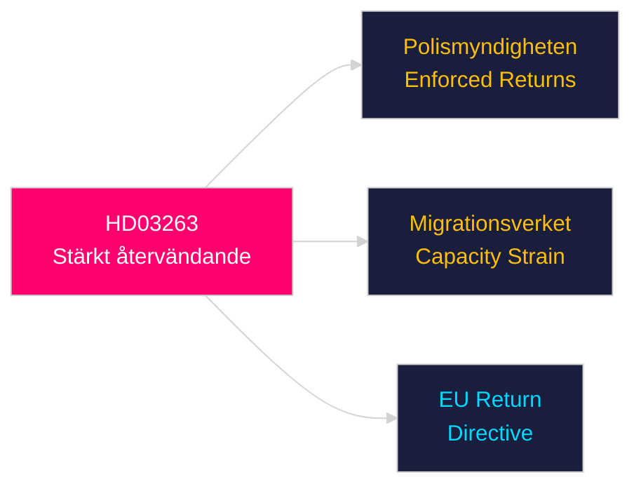

# Per-Document Intelligence Analysis: HD03263

**dok_id**: HD03263  
**Title**: Stärkt återvändandeverksamhet  
**Type**: prop (Government Proposition)  
**Committee**: Justitiedepartementet  
**Date**: 2026-04-30  
**DIW Score**: 8.0 — L2+ Priority  
**Source**: https://data.riksdagen.se/dokument/HD03263  

## Executive Summary

HD03263 strengthens Sweden's return operations for migrants without legal right of residence. This is the enforcement complement to HD03262 — together they form a comprehensive migration control package. The proposition signals willingness to use coercive enforcement measures and aligns with the hardest-line positions within the Tidöalliansen.

## Key Intelligence Points

| Dimension | Assessment |
|-----------|-----------|
| Policy significance | High — enforcement capacity building |
| Electoral relevance | High — "effective returns" is key Tidöalliansen messaging |
| EU context | Supported by EU Return Directive transposition |
| Opposition | Humanitarian NGOs, S and V will oppose; legal challenges probable |
| Implementation risk | Polismyndigheten and Migrationsverket capacity constraints |
| Statskontoret relevance | https://www.statskontoret.se/publicerat/rapporter/ — capacity analysis pending; Statskontoret has flagged enforcement capacity gaps in prior reviews |

## Confidence

Source reliability: A1  
Assessment confidence: HIGH

