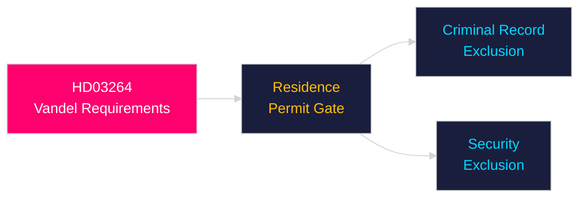

# Per-Document Intelligence Analysis: HD03264

**dok_id**: HD03264  
**Title**: Skärpta och tydligare krav på vandel för uppehållstillstånd  
**Type**: prop (Government Proposition)  
**Committee**: Justitiedepartementet  
**Date**: 2026-04-30  
**DIW Score**: 7.5 — L2+ Priority  
**Source**: https://data.riksdagen.se/dokument/HD03264  

## Executive Summary

HD03264 sharpens character requirements for residence permits — disqualifying applicants with criminal records or national-security concerns. Part of the four-proposition immigration package HD03262/HD03263/HD03264/HD03265. Signals a punitive-conditional immigration framework replacing the integration-first model.

## Key Intelligence Points

| Dimension | Assessment |
|-----------|-----------|
| Policy significance | Moderate-high — narrows eligibility criteria |
| Electoral relevance | Moderate — reinforces "law and order + migration control" axis |
| Legal exposure | Risk of discrimination challenges; ECHR Art. 8 (family life) concerns |
| Migrationsverket | Additional capacity requirement to assess character |
| Statskontoret relevance | none found |

## Confidence

Source reliability: A1  
Assessment confidence: HIGH

