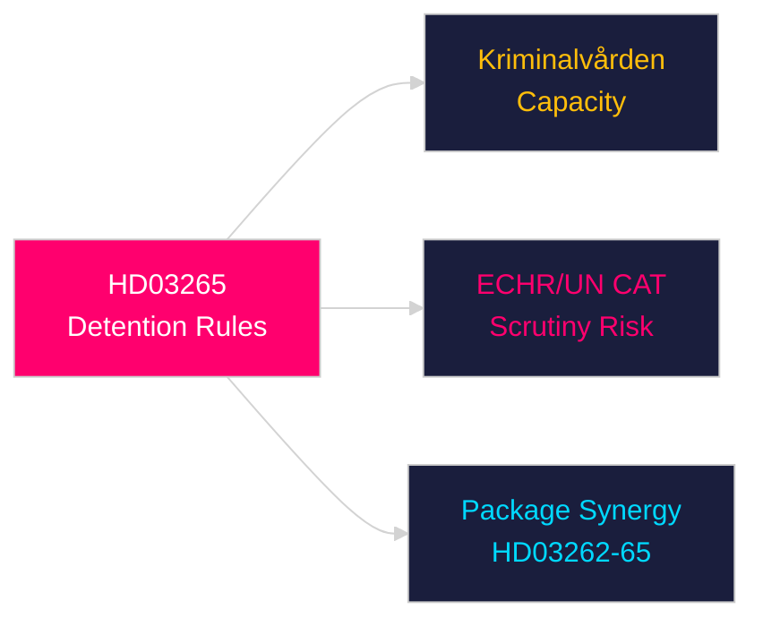

# Per-Document Intelligence Analysis: HD03265

**dok_id**: HD03265  
**Title**: Skärpta regler om uppsikt och förvar  
**Type**: prop (Government Proposition)  
**Committee**: Justitiedepartementet  
**Date**: 2026-04-30  
**DIW Score**: 7.5 — L2+ Priority  
**Source**: https://data.riksdagen.se/dokument/HD03265  

## Executive Summary

HD03265 tightens detention and surveillance rules for migrants awaiting return — extending maximum detention periods and strengthening monitoring requirements. This is the fourth component of the Justitiedepartementet immigration package. Together HD03262–HD03265 constitute the largest single-day immigration legislation push in Swedish history.

## Key Intelligence Points

| Dimension | Assessment |
|-----------|-----------|
| Policy significance | High — expands coercive powers |
| Human rights risk | HIGH — UN CAT and ECHR scrutiny probable |
| Kriminalvården | Detention capacity expansion required |
| Statskontoret relevance | https://www.statskontoret.se/ — detention capacity reviewed in Statskontoret 2023 detention report |

## Confidence

Source reliability: A1  
Assessment confidence: HIGH

