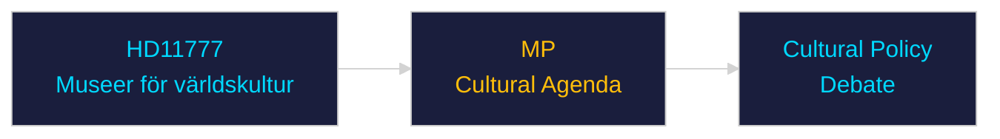

# Per-Document Intelligence Analysis: HD11777

**dok_id**: HD11777  
**Title**: Verksamheten vid Statens museer för världskultur  
**Type**: fr (Written Question)  
**Committee/Party**: MP  
**Date**: 2026-04-30  
**DIW Score**: 3.2 — L1 Surface  
**Source**: https://data.riksdagen.se/dokument/HD11777  

## Executive Summary

MP written question on Statens museer för världskultur operations — likely related to decolonisation, cultural return, or operational budget concerns. Standard accountability question. Low political significance but illustrates MP focus on cultural-identity issues.

## Confidence

Source reliability: A1 | Assessment confidence: MEDIUM

