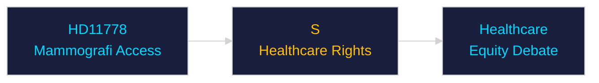

# Per-Document Intelligence Analysis: HD11778

**dok_id**: HD11778  
**Title**: Nekad mammografi på grund av grav funktionsnedsättning  
**Type**: fr (Written Question)  
**Committee/Party**: S  
**Date**: 2026-04-30  
**DIW Score**: 3.5 — L1 Surface  
**Source**: https://data.riksdagen.se/dokument/HD11778  

## Executive Summary

S written question on denied mammography access for severely disabled patients — accessibility gap in cancer screening. Part of S healthcare rights agenda. Low national significance but emotionally resonant healthcare equity issue pre-election.

## Confidence

Source reliability: A1 | Assessment confidence: MEDIUM

