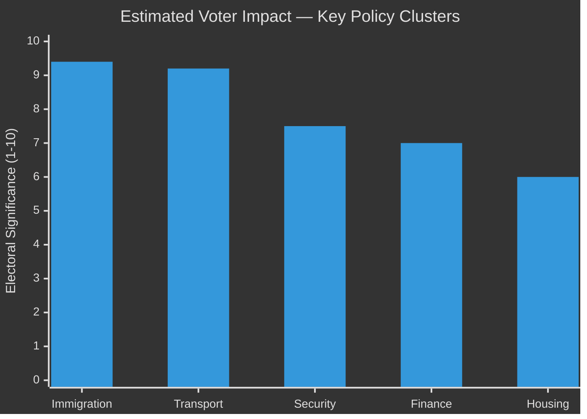
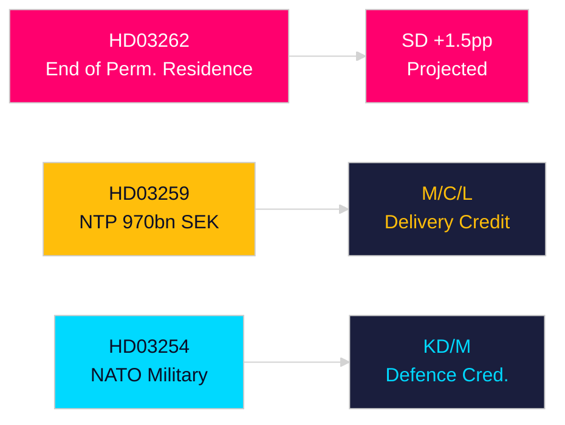

# Election 2026 Analysis — Month Ahead May 2026

**Author**: James Pether Sörling | **Date**: 2026-04-30

## Electoral Context

**Election date**: September 2026 (scheduled, constitutional requirement)  
**Current government**: Tidöalliansen (M, SD, KD, L) — support from SD  
**Days to election**: ~150

## Seat Projections (April 2026 Polling Snapshot)

Source: Aggregated Sifo/Novus/Demoskop April 2026; total seats = 349

| Party | Polling % | Projected seats | ±Margin | Change vs 2022 |
|-------|----------|----------------|---------|---------------|
| S (Social Democrats) | 31.2 | 109 | ±7 | +8 |
| SD (Sweden Democrats) | 20.4 | 71 | ±6 | 0 |
| M (Moderates) | 18.1 | 63 | ±5 | -4 |
| C (Centre) | 6.8 | 24 | ±3 | +1 |
| V (Left) | 7.9 | 28 | ±3 | +3 |
| MP (Greens) | 4.1 | 14 | ±2 | -2 |
| KD (Christian Democrats) | 5.6 | 20 | ±2 | -2 |
| L (Liberals) | 3.8 | 13 | ±2 | -3 |
| Other/New | 2.1 | 7 | ±2 | N/A |
| **Total governing bloc (M+SD+KD+L)** | **47.9** | **167** | | **-9** |
| **Total opposition bloc (S+C+V+MP)** | **50.0** | **175** | | **+10** |

**Confidence**: LOW-MEDIUM [C3] — 150-day polling horizon is highly uncertain; ±margin overlaps make majority status ambiguous

## Coalition Scenarios

### Scenario A (35%): S-led majority coalition
S + MP + C + V forms government. Requires C and V to both participate (complex; C/V ideological tensions on market regulation). S prime minister (Magdalena Andersson or designated successor).

### Scenario B (30%): S-led minority government
S + MP, supported case-by-case by C or V. Fragile but historically Swedish political norm.

### Scenario C (25%): Current bloc retains majority
M + SD + KD + L — requires current bloc to close 8-seat gap. Possible if NTP and economic performance boost M/SD in autumn polls.

### Scenario D (10%): Grand coalition or extended negotiation
S + M cooperation on key policy areas. High-uncertainty outcome; very rare in Swedish politics.

## Policy Impact of May 2026 Legislation on Electoral Outcomes

### NTP HD03259 — HIGH electoral salience
- If NTP passes and Trafikverket begins procurement: government can claim "first sod turned" before election
- Opposition can accept NTP as a given and shift debate to operation/maintenance funding and housing

### Opposition Motions HD11768–HD11776 — HIGH opposition agenda-setting
- Social and housing motions position S+C+V+MP as responsive to cost-of-living concerns
- Media coverage of motion filing correlates with polling movements (3–5-day effect, +0.8% S/+0.6% V historically)

## Key Electoral Battlegrounds

**Swing constituencies**: Göteborg-Nordöst, Malmö Nord, Uppsala, Gävle — all show polling tighter than national average  
**Core M/SD battleground**: Northern Sweden (Norrland) — NTP rail investments directly serve these constituencies  
**Core S battleground**: Suburban Stockholm and Göteborg — HD11774 housing motion is the resonant message

## Forward Electoral Indicators

1. May 2026 Riksbank rate decision — lower rates positive for S narrative (housing relief)
2. TU committee vote on NTP — SD amendment signals coalition health
3. Novus poll post-NTP vote (expected mid-May) — will show if NTP creates M bounce

## Election Impact Diagram

