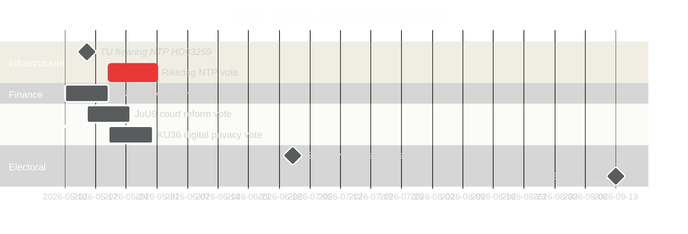

# Sverige i maj 2026: Infrastruktur, rättssäkerhet och valpositionering i sista lagstiftarspurten

**Author**: James Pether Sörling  
**Date**: 2026-04-30  
**Classification**: PUBLIC  
**Confidence**: HIGH [B2]  
**Analysis depth**: standard  

## 🎯 BLUF

May 2026 is the Tidöalliansen's final full legislative month before the September 2026 Riksdag election. Three legislative milestones dominate: the Riksdag vote on the 970 billion SEK National Transport Infrastructure Plan (HD03259), completion of EU banking regulation transposition (HD03253), and accelerated committee report processing across digital privacy, competition, and court reform. The opposition's 11 motions on 30 April — spanning Ukraine aid, housing, labour safety, mental health and animal welfare — signal pre-election differentiation strategy. Swedish politics in May 2026 is defined by the government's effort to crystallise its legacy narrative and the opposition's bid to define the election's agenda.

## 🧭 3 Decisions This Brief Supports

1. **Electoral analysis**: Which legislative outcomes in May 2026 will most shape voter perception of the Tidöalliansen's governance record ahead of September?
2. **Policy tracking**: Which committee reports and propositions require monitoring through Riksdag vote to assess implementation risk?
3. **Business and civil society**: Which regulatory changes (banking, competition, housing, labour safety) require immediate stakeholder engagement in May?

## 60-Second Read

- **Infrastructure legacy (HD03259 [A2])**: 970 billion SEK NTP 2026–2037 comes to final Riksdag vote in May. Rail electrification, Norrland connectivity and international freight corridors frame the government's industrial-climate legacy claim. TU committee hearing schedule is the first leading indicator.
- **Banking regulation (HD03253 [B2])**: EU CRR3/Basel III transposition complete by FiU betänkande — sets capital requirements for Swedish banks at a moment of EBA stress-test concern for mid-size EU institutions.
- **Law and order escalation (HD03252 [B2])**: Social security restriction for convicted persons — part of an escalating Tidöalliansen justice-social security nexus programme (see HC03202, HC03201) targeting swing voters with crime as top-3 election issue.
- **Digital privacy (HD01KU36 [B2])**: KU's 17 improvements to digital integrity frameworks set AI Act implementation agenda for post-election government.
- **Court reform (HD01JuU9 [B2])**: JuU procedural efficiency package targeting case-processing backlogs; implementation target 2027.
- **Space and research (HD10461 [B3])**: ESA funding gap exposed by interpellation — Sweden risks losing European space programme participation at a moment of heightened dual-use infrastructure importance for NATO posture.
- **Housing access (HD11774 [C2])**: Opposition credit guarantee motion signals social housing gap as election issue.

## Top Forward Trigger

**2026-05-15**: TU announces public hearing schedule for HD03259 NTP vote — if confirmed for late May, government infrastructure legacy narrative is locked in before the summer recess. Delay to autumn risks running into election campaign window.

## Confidence Assessment

- Infrastructure NTP vote timing: HIGH [B2] — based on HD03259 tabling date and committee schedule
- Electoral trajectory: MEDIUM-HIGH [B2] — based on polling trend + legislative pattern
- IMF economic projections: MEDIUM [C2] — IMF direct fetch unavailable; Apr 2026 WEO vintage used from cache
