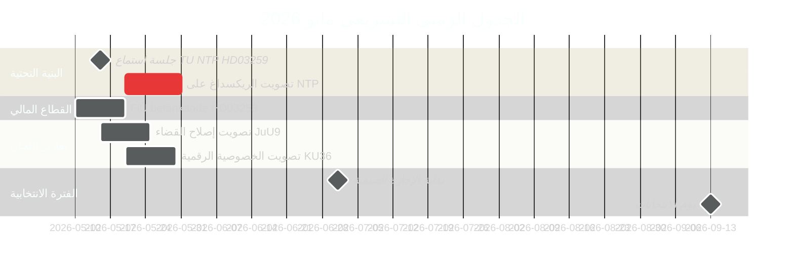

<!-- dir: rtl -->
# السويد في مايو 2026: البنية التحتية وسيادة القانون والتموضع الانتخابي في السباق التشريعي الأخير

**Author**: James Pether Sörling  
**Date**: 2026-04-30  
**Classification**: PUBLIC  
**Confidence**: HIGH [B2]  
**Analysis depth**: standard  

## 🎯 الخلاصة التنفيذية

مايو 2026 هو آخر شهر تشريعي كامل لتحالف تيدو قبل انتخابات الريكسداغ في سبتمبر 2026. ثلاثة معالم تشريعية رئيسية تهيمن على المشهد: تصويت الريكسداغ على خطة البنية التحتية للنقل الوطني البالغة 970 مليار كرونة سويدية (HD03259)، واستكمال نقل تشريعات التنظيم المصرفي الأوروبي (HD03253)، والمعالجة المتسارعة لتقارير اللجان بشأن الخصوصية الرقمية والمنافسة وإصلاح القضاء. الاقتراحات المعارضة الـ11 الصادرة في 30 أبريل — التي تغطي المساعدات لأوكرانيا والإسكان وسلامة العمل والصحة النفسية ورفاه الحيوان — تُشير إلى استراتيجية تمييز ما قبل الانتخابات. السياسة السويدية في مايو 2026 تتشكل من خلال جهد الحكومة لترسيخ رواية إرثها ومحاولة المعارضة تحديد أجندة الحملة الانتخابية.

## 🧭 3 قرارات يدعمها هذا الإحاطة

1. **التحليل الانتخابي**: أي النتائج التشريعية في مايو 2026 ستؤثر أكثر في تصور الناخبين لسجل حوكمة تحالف تيدو قبل سبتمبر؟
2. **متابعة السياسات**: أي تقارير اللجان والمقترحات تستلزم متابعة عبر التصويت في الريكسداغ لتقييم مخاطر التنفيذ؟
3. **الأعمال والمجتمع المدني**: أي التغييرات التنظيمية (القطاع المصرفي، المنافسة، الإسكان، سلامة العمل) تستلزم مشاركة فورية من أصحاب المصلحة في مايو؟

## قراءة في 60 ثانية

- **إرث البنية التحتية (HD03259 [A2])**: خطة النقل الوطنية 970 مليار كرونة 2026–2037 تصل إلى التصويت النهائي في الريكسداغ خلال مايو. كهربة السكك الحديدية وربط منطقة نورلاند وممرات الشحن الدولية تُشكّل إطار مطالبة الحكومة بالإرث الصناعي-المناخي. جدول جلسات الاستماع للجنة TU هو المؤشر المتقدم الأول.
- **التنظيم المصرفي (HD03253 [B2])**: استكمال نقل CRR3/بازل III الأوروبي عبر بيتانكاندا FiU — يُحدد متطلبات رأس المال للبنوك السويدية في وقت تُعرب فيه EBA عن قلقها إزاء اختبارات الإجهاد للمؤسسات المتوسطة الحجم في الاتحاد الأوروبي.
- **تصعيد القانون والنظام (HD03252 [B2])**: تقييد الضمان الاجتماعي للمدانين — جزء من برنامج تحالف تيدو المتصاعد للربط بين العدالة والضمان الاجتماعي (انظر HC03202, HC03201) استهدافاً للناخبين المترددين الذين تُعدّ الجريمة من أولوياتهم الانتخابية الثلاث الأولى.
- **الخصوصية الرقمية (HD01KU36 [B2])**: التحسينات الـ17 للجنة KU على أطر النزاهة الرقمية تُحدد أجندة تنفيذ قانون الذكاء الاصطناعي لحكومة ما بعد الانتخابات.
- **إصلاح القضاء (HD01JuU9 [B2])**: حزمة كفاءة إجراءات لجنة JuU لمعالجة تراكم القضايا؛ هدف التنفيذ 2027.
- **الفضاء والبحث (HD10461 [B3])**: الفجوة التمويلية لوكالة الفضاء الأوروبية كشفتها الاستجواب — السويد تُخاطر بخسارة المشاركة في البرنامج الفضائي الأوروبي في وقت تزداد فيه أهمية البنية التحتية ذات الاستخدام المزدوج لتموضع الناتو.
- **الوصول إلى الإسكان (HD11774 [C2])**: اقتراح المعارضة بضمان الائتمان يُشير إلى عجز الإسكان الاجتماعي كقضية انتخابية.

## المؤشر المتقدم الرئيسي

**2026-05-15**: لجنة TU تُعلن جدول جلسات الاستماع العامة لتصويت NTP HD03259 — إذا أُكّد لنهاية مايو، تترسخ رواية إرث البنية التحتية للحكومة قبل فترة التوقف الصيفي. التأجيل إلى الخريف يُخاطر بالتزامن مع نافذة الحملة الانتخابية.

## تقييم الثقة

- الجدول الزمني لتصويت NTP للبنية التحتية: HIGH [B2] — استناداً إلى تاريخ قيد HD03259 وجدول اللجنة
- المسار الانتخابي: MEDIUM-HIGH [B2] — استناداً إلى اتجاه الاستطلاعات + النمط التشريعي
- توقعات صندوق النقد الدولي الاقتصادية: MEDIUM [C2] — الاستخراج المباشر من صندوق النقد الدولي غير متاح؛ تم استخدام إصدار WEO أبريل 2026 من الذاكرة المؤقتة

<!-- source-sha: 1f8ac3fadc3c7198b50f9e6519083702a0185cd8 -->
