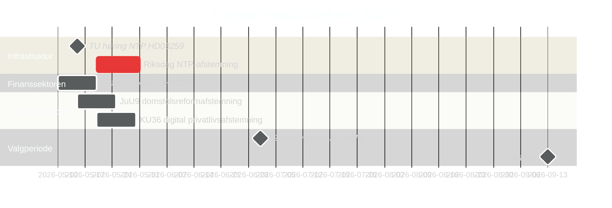

# Sverige i maj 2026: Infrastruktur, retssikkerhed og valgpositionering i den endelige lovgivningsspurt

**Author**: James Pether Sörling  
**Date**: 2026-04-30  
**Classification**: PUBLIC  
**Confidence**: HIGH [B2]  
**Analysis depth**: standard  

## 🎯 BLUF

Maj 2026 er Tidöalliansens sidste fulde lovgivningsmåned inden Riksdag-valget i september 2026. Tre lovgivningsmilestene dominerer: Riksdag-afstemningen om den nationale transportinfrastrukturplan på 970 mia. SEK (HD03259), afslutningen af EU-bankreguleringstransposering (HD03253) og accelereret udvalgsbehandling af digital privatliv, konkurrence og domstolsreform. Oppositionens 11 motioner den 30. april — om Ukraine-støtte, boliger, arbejdssikkerhed, mental sundhed og dyrevelfærd — signalerer en strategi for præ-valg-differentiering. Svensk politik i maj 2026 er præget af regeringens bestræbelse på at fastholde sin arvsfortælling og oppositionens bud på at definere valgkampagnens dagsorden.

## 🧭 3 beslutninger dette briefing understøtter

1. **Valganalyse**: Hvilke lovgivningsresultater i maj 2026 vil mest forme vælgernes opfattelse af Tidöalliansens styringsrekord forud for september?
2. **Politikopfølgning**: Hvilke udvalgsrapporter og lovforslag kræver overvågning gennem Riksdag-afstemning for at vurdere implementeringsrisiko?
3. **Erhvervslivet og civilsamfundet**: Hvilke regelændringer (bank, konkurrence, bolig, arbejdssikkerhed) kræver øjeblikkelig interessentinddragelse i maj?

## 60-sekunders læsning

- **Infrastrukturarv (HD03259 [A2])**: 970 mia. SEK NTP 2026–2037 kommer til endelig Riksdag-afstemning i maj. Jernbaneelektrificering, Norrland-forbindelser og internationale godsforbindelser rammesætter regeringens industri-klimatarvskrav. TU-udvalgets høringsskema er den første ledende indikator.
- **Bankregulering (HD03253 [B2])**: EU CRR3/Basel III-transponering fuldført via FiU betänkande — fastsætter kapitalkrav for svenske banker i et øjeblik med EBA-stresstestbekymring for mellemstore EU-institutioner.
- **Lov og orden-eskalering (HD03252 [B2])**: Social sikkerhedsrestriktion for dømte — del af et eskalerende Tidöalliansen retsafdelings-social sikkerhedssamspilsprogram (se HC03202, HC03201) rettet mod svingvælgere med kriminalitet som top-3-valgspørgsmål.
- **Digital privatliv (HD01KU36 [B2])**: KU's 17 forbedringer af digitale integritetssystemer sætter AI Act-implementeringsdagsordenen for post-valg-regeringen.
- **Domstolsreform (HD01JuU9 [B2])**: JuU-proceduremæssig effektivitetspakke rettet mod sagsbehandlingsefterslæb; implementeringsmål 2027.
- **Rum og forskning (HD10461 [B3])**: ESA-finansieringsgab afsløret ved interpellation — Sverige risikerer at miste deltagelse i det europæiske rumprogram i et øjeblik med øget dual-use-infrastrukturvigt for NATO-positionering.
- **Boligadgang (HD11774 [C2])**: Oppositionens kreditgarantibevægelse signalerer socialt boliggab som valgspørgsmål.

## Ledende fremadrettet indikator

**2026-05-15**: TU annoncerer offentlig høringsskema for HD03259 NTP-afstemning — hvis bekræftet til sen maj, er regeringens infrastrukturarvsfortælling låst inden sommerpausen. Forsinkelse til efteråret risikerer at løbe ind i valgkampagnevinduet.

## Konfidensvurdering

- Infrastruktur NTP-afstemningsdato: HIGH [B2] — baseret på HD03259 tabelleringsdato og udvalgsplan
- Valgbane: MEDIUM-HIGH [B2] — baseret på meningsmålingstrend + lovgivningsmønster
- IMF-økonomiske prognoser: MEDIUM [C2] — IMF direkt hentning utilgængelig; WEO-årgang apr-2026 brugt fra cache

<!-- source-sha: 1f8ac3fadc3c7198b50f9e6519083702a0185cd8 -->
