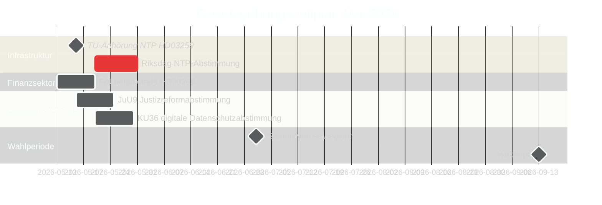

# Schweden im Mai 2026: Infrastruktur, Rechtssicherheit und Wahlpositionierung in der finalen Gesetzgebungsphase

**Author**: James Pether Sörling  
**Date**: 2026-04-30  
**Classification**: PUBLIC  
**Confidence**: HIGH [B2]  
**Analysis depth**: standard  

## 🎯 BLUF

Mai 2026 ist der letzte vollständige Gesetzgebungsmonat der Tidöalliansen vor den Riksdag-Wahlen im September 2026. Drei Gesetzgebungsmeilensteine dominieren: die Riksdag-Abstimmung über den nationalen Verkehrsinfrastrukturplan im Wert von 970 Mrd. SEK (HD03259), der Abschluss der EU-Bankregulierungstransposition (HD03253) und die beschleunigte Ausschussbearbeitung in den Bereichen digitale Privatsphäre, Wettbewerb und Justizreform. Die 11 Anträge der Opposition vom 30. April — zu Ukraine-Hilfe, Wohnungsbau, Arbeitssicherheit, psychische Gesundheit und Tierschutz — signalisieren eine Strategie zur Vor-Wahl-Profilierung. Die schwedische Politik im Mai 2026 wird durch die Bemühungen der Regierung geprägt, ihre Erbenarrative zu festigen, und durch das Bestreben der Opposition, die Wahlkampfagenda zu definieren.

## 🧭 3 Entscheidungen, die dieses Briefing unterstützt

1. **Wahlanalyse**: Welche Gesetzgebungsergebnisse im Mai 2026 werden die Wahrnehmung der Wähler von der Bilanz der Tidöalliansen vor September am stärksten beeinflussen?
2. **Politikverfolgung**: Welche Ausschussberichte und Gesetzesvorlagen müssen durch Riksdag-Abstimmungen verfolgt werden, um Umsetzungsrisiken zu bewerten?
3. **Wirtschaft und Zivilgesellschaft**: Welche regulatorischen Änderungen (Bankwesen, Wettbewerb, Wohnungsbau, Arbeitssicherheit) erfordern im Mai ein sofortiges Stakeholder-Engagement?

## 60-Sekunden-Lektüre

- **Infrastrukturvermächtnis (HD03259 [A2])**: Der 970 Mrd. SEK NTP 2026–2037 kommt im Mai zur endgültigen Riksdag-Abstimmung. Bahnelektrifizierung, Norrland-Anbindung und internationale Güterkorridore bilden den Industrie-Klimaerbe-Anspruch der Regierung. Der TU-Ausschusskomplex ist der erste Frühindikator.
- **Bankregulierung (HD03253 [B2])**: EU-CRR3/Basel-III-Transposition über FiU-Betänkande abgeschlossen — legt Eigenkapitalanforderungen für schwedische Banken fest, zu einem Zeitpunkt, an dem EBA-Stresstestbedenken für mittelgroße EU-Institute bestehen.
- **Gesetz-und-Ordnung-Eskalation (HD03252 [B2])**: Sozialversicherungsbeschränkung für Verurteilte — Teil eines eskalierenden Tidöalliansen-Justiz-Sozialversicherungs-Nexusprogramms (siehe HC03202, HC03201) für Wechselwähler mit Kriminalität als Top-3-Wahlthema.
- **Digitaler Datenschutz (HD01KU36 [B2])**: KUs 17 Verbesserungen der Rahmenbedingungen für digitale Integrität setzen die KI-Gesetz-Umsetzungsagenda für die Regierung nach der Wahl.
- **Justizreform (HD01JuU9 [B2])**: JuU-Verfahrenseffizienzpaket zur Bekämpfung von Bearbeitungsrückständen; Umsetzungsziel 2027.
- **Raumfahrt und Forschung (HD10461 [B3])**: ESA-Finanzierungslücke durch Interpellation aufgedeckt — Schweden riskiert den Verlust der Teilnahme am europäischen Raumfahrtprogramm in einem Moment erhöhter Dual-use-Infrastrukturbedeutung für die NATO-Positionierung.
- **Wohnungszugang (HD11774 [C2])**: Kreditgarantieantrag der Opposition signalisiert soziales Wohnungsdefizit als Wahlthema.

## Führender Vorwärtsindikator

**2026-05-15**: TU kündigt öffentlichen Anhörungszeitplan für HD03259-NTP-Abstimmung an — wenn für Ende Mai bestätigt, ist das Infrastrukturvermächtnisnarrativ der Regierung vor der Sommerpause festgeschrieben. Eine Verzögerung auf Herbst riskiert das Hineinlaufen in das Wahlkampffenster.

## Konfidenzbewertung

- Infrastruktur-NTP-Abstimmungszeitpunkt: HIGH [B2] — basierend auf Tabellierungsdatum von HD03259 und Ausschussplan
- Wahltrajektorie: MEDIUM-HIGH [B2] — basierend auf Umfragetrend + Gesetzgebungsmuster
- IMF-Wirtschaftsprognosen: MEDIUM [C2] — IMF-Direktabruf nicht verfügbar; WEO-Ausgabe Apr. 2026 aus Cache verwendet

<!-- source-sha: 1f8ac3fadc3c7198b50f9e6519083702a0185cd8 -->
