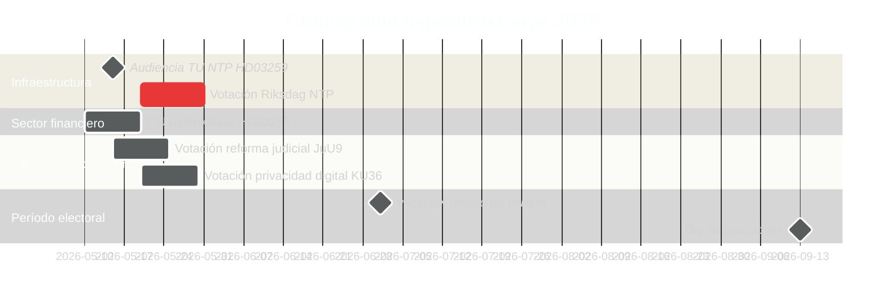

# Suecia en mayo de 2026: Infraestructura, estado de derecho y posicionamiento electoral en el sprint legislativo final

**Author**: James Pether Sörling  
**Date**: 2026-04-30  
**Classification**: PUBLIC  
**Confidence**: HIGH [B2]  
**Analysis depth**: standard  

## 🎯 BLUF

Mayo de 2026 es el último mes legislativo completo de la Tidöalliansen antes de las elecciones al Riksdag de septiembre de 2026. Tres hitos legislativos dominan: la votación del Riksdag sobre el Plan Nacional de Infraestructura de Transporte de 970 mil millones de SEK (HD03259), la finalización de la transposición de la regulación bancaria de la UE (HD03253) y el procesamiento acelerado de informes de comisión sobre privacidad digital, competencia y reforma judicial. Las 11 mociones de la oposición del 30 de abril — que abarcan ayuda a Ucrania, vivienda, seguridad laboral, salud mental y bienestar animal — señalan una estrategia de diferenciación preelectoral. La política sueca en mayo de 2026 está definida por el esfuerzo del gobierno por cristalizar su narrativa de legado y el intento de la oposición de definir la agenda de la campaña electoral.

## 🧭 3 decisiones que este informe apoya

1. **Análisis electoral**: ¿Qué resultados legislativos en mayo de 2026 influirán más en la percepción de los votantes sobre el historial de gobernanza de la Tidöalliansen antes de septiembre?
2. **Seguimiento de políticas**: ¿Qué informes de comisión y proposiciones requieren seguimiento mediante votación en el Riksdag para evaluar los riesgos de implementación?
3. **Empresas y sociedad civil**: ¿Qué cambios regulatorios (banca, competencia, vivienda, seguridad laboral) requieren participación inmediata de las partes interesadas en mayo?

## Lectura de 60 segundos

- **Legado de infraestructura (HD03259 [A2])**: El NTP 2026–2037 de 970 mil millones de SEK llega a la votación final del Riksdag en mayo. La electrificación ferroviaria, la conectividad del Norrland y los corredores de carga internacional enmarcan la reclamación de legado industrial-climático del gobierno. El calendario de audiencias del comité TU es el primer indicador adelantado.
- **Regulación bancaria (HD03253 [B2])**: La transposición EU CRR3/Basilea III se completa mediante el betänkande del FiU — establece los requisitos de capital para los bancos suecos en un momento de preocupaciones de pruebas de estrés de la EBA para instituciones de tamaño medio de la UE.
- **Escalada de ley y orden (HD03252 [B2])**: Restricción de seguridad social para condenados — parte de un programa Tidöalliansen justicia-seguridad social en escalada (véase HC03202, HC03201) dirigido a votantes indecisos con la criminalidad como tema electoral número 3.
- **Privacidad digital (HD01KU36 [B2])**: Las 17 mejoras del KU a los marcos de integridad digital establecen la agenda de implementación de la Ley de IA para el gobierno poselectoral.
- **Reforma judicial (HD01JuU9 [B2])**: Paquete de eficiencia procesal del JuU orientado a los retrasos en el procesamiento de casos; objetivo de implementación 2027.
- **Espacio e investigación (HD10461 [B3])**: Brecha de financiamiento de la ESA expuesta por interpelación — Suecia arriesga perder la participación en el programa espacial europeo en un momento de mayor importancia de la infraestructura de doble uso para el posicionamiento de la OTAN.
- **Acceso a la vivienda (HD11774 [C2])**: La moción de garantía de crédito de la oposición señala una brecha de vivienda social como tema electoral.

## Principal indicador adelantado

**2026-05-15**: TU anuncia el calendario de audiencias públicas para la votación NTP HD03259 — si se confirma para finales de mayo, la narrativa del legado de infraestructura del gobierno queda fijada antes del receso de verano. Un retraso al otoño arriesga coincidir con la ventana de campaña electoral.

## Evaluación de confianza

- Calendario de votación NTP de infraestructura: HIGH [B2] — basado en la fecha de presentación de HD03259 y el calendario del comité
- Trayectoria electoral: MEDIUM-HIGH [B2] — basado en la tendencia de encuestas + el patrón legislativo
- Proyecciones económicas del FMI: MEDIUM [C2] — extracción directa del FMI no disponible; se utilizó la cosecha WEO abr-2026 desde la caché

<!-- source-sha: 1f8ac3fadc3c7198b50f9e6519083702a0185cd8 -->
