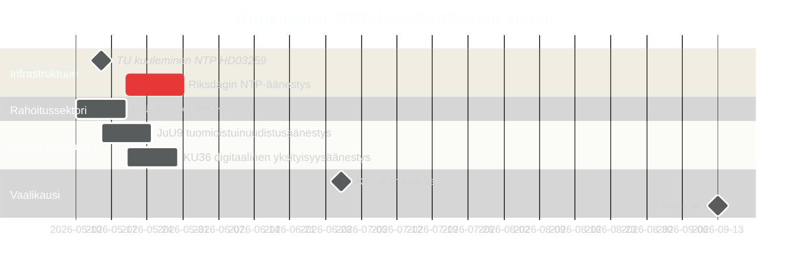

# Ruotsi toukokuussa 2026: Infrastruktuuri, oikeusturva ja vaalipositiointi viimeisessä lainsäädäntökirimatseissa

**Author**: James Pether Sörling  
**Date**: 2026-04-30  
**Classification**: PUBLIC  
**Confidence**: HIGH [B2]  
**Analysis depth**: standard  

## 🎯 BLUF

Toukokuu 2026 on Tidöallianssin viimeinen täysi lainsäädäntökuukausi ennen syyskuun 2026 vaaleja. Kolme lainsäädäntöverstaista hallitsee: Riksdagin äänestys 970 miljardin kruunun kansallisesta liikenneinfrastruktuurisuunnitelmasta (HD03259), EU:n pankkisääntelytransposition viimeistely (HD03253) sekä digitaalisen yksityisyyden, kilpailun ja tuomioistuinuudistuksen valiokuntaraporttien nopeutettu käsittely. Opposition 11 pontta 30. huhtikuuta — kattaen Ukraina-tuen, asumisen, työturvallisuuden, mielenterveyden ja eläinten hyvinvoinnin — signaloi vaalierilaistamisen strategiaa. Ruotsin politiikkaa toukokuussa 2026 määrittelee hallituksen pyrkimys vahvistaa perintönarratiiviaan ja opposition yritys muotoilla vaalikampanjan agenda.

## 🧭 3 päätöstä, joita tämä tiedote tukee

1. **Vaalitutkimus**: Mitkä lainsäädäntötulokset toukokuussa 2026 vaikuttavat eniten äänestäjien käsitykseen Tidöallianssin hallintotavasta ennen syyskuuta?
2. **Politiikkaseuranta**: Mitkä valiokuntaraportit ja lakiesitykset vaativat seurantaa Riksdagin äänestyksen kautta toteutumisriskin arvioimiseksi?
3. **Yritykset ja kansalaisyhteiskunta**: Mitkä sääntelymuutokset (pankit, kilpailu, asuminen, työturvallisuus) vaativat välitöntä sidosryhmäosallistumista toukokuussa?

## 60 sekunnin lukeminen

- **Infrastruktuuriperintö (HD03259 [A2])**: 970 miljardin kruunun NTP 2026–2037 tulee lopulliseen Riksdagin äänestykseen toukokuussa. Rautateiden sähköistäminen, Pohjois-Ruotsin yhteydet ja kansainväliset tavaraliikennekäytävät kehystävät hallituksen teollisuus-ilmastoarvovaatimuksen. TU-valiokunnan kuulemisaikataulu on ensimmäinen johtava indikaattori.
- **Pankkisäätely (HD03253 [B2])**: EU:n CRR3/Basel III -transposition viimeistely FiU betänkanden kautta — asettaa pääomavaatimukset ruotsalaisille pankeille EBA:n stressitestikysymysten herättämällä hetkellä keskikokoisille EU-laitoksille.
- **Laki ja järjestys -eskalaatio (HD03252 [B2])**: Sosiaaliturvan rajoittaminen tuomituille — osa etenevää Tidöallianssin oikeus-sosiaaliturvaneksus-ohjelmaa (ks. HC03202, HC03201) suunnattu svingiäänestäjille rikollisuuden ollessa top-3-vaaliaihe.
- **Digitaalinen yksityisyys (HD01KU36 [B2])**: KU:n 17 digitaalisten yksityisyyskehysten parannusta asettaa tekoälyasetus-toteutusagendan vaalien jälkeiselle hallitukselle.
- **Tuomioistuinuudistus (HD01JuU9 [B2])**: JuU:n prosessuaalinen tehokkuuspaketti kohdistuen käsittelyaikaeroihin; toteutustavoite 2027.
- **Avaruus ja tutkimus (HD10461 [B3])**: ESA-rahoitusvaje paljastettu interpellaation kautta — Ruotsi riskeeraa eurooppalaisen avaruusohjelman osallistumisen menettämisen hetkellä, jolloin kaksikäyttöinfrastruktuurin merkitys NATO-asemointiin on kasvanut.
- **Asuntoihin pääsy (HD11774 [C2])**: Opposition luottotakauslause signaloi sosiaalista asumisaukkoa vaaliasiana.

## Johtava eteenpäin katsova indikaattori

**2026-05-15**: TU ilmoittaa julkisesta kuulemisaikataulusta HD03259 NTP:n äänestystä varten — jos vahvistetaan toukokuun loppuun, hallituksen infrastruktuuriperintönarratiivi on lukittu ennen kesälomaa. Syksyyn viivästyminen riskeeraa törmäystä vaalikampanjaaikaikkunan kanssa.

## Luottamustasioarvio

- Infrastruktuurin NTP-äänestyksen ajoitus: HIGH [B2] — HD03259:n taulukointipäivämäärään ja valiokunta-aikatauluun perustuen
- Vaaliraita: MEDIUM-HIGH [B2] — mielipidemittaustrend + lainsäädäntömalli perustuen
- IMF:n taloudelliset ennusteet: MEDIUM [C2] — IMF:n suorahaku ei saatavilla; WEO-vuosikerta huhtikuu 2026 käytetty välimuistista

<!-- source-sha: 1f8ac3fadc3c7198b50f9e6519083702a0185cd8 -->
