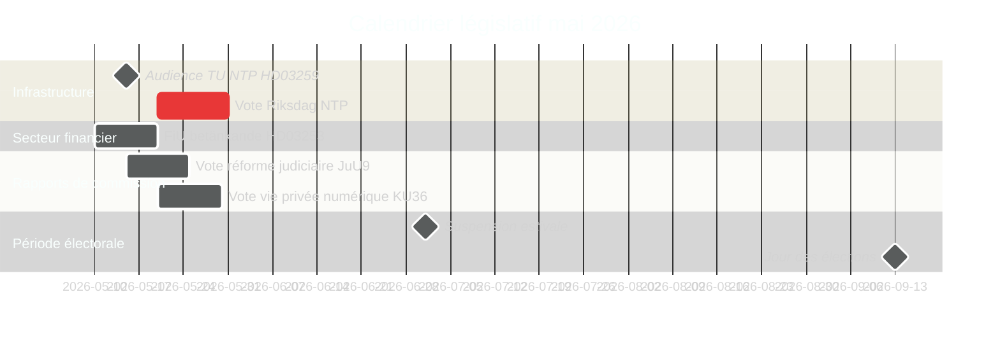

# La Suède en mai 2026 : Infrastructure, état de droit et positionnement électoral dans le sprint législatif final

**Author**: James Pether Sörling  
**Date**: 2026-04-30  
**Classification**: PUBLIC  
**Confidence**: HIGH [B2]  
**Analysis depth**: standard  

## 🎯 BLUF

Mai 2026 est le dernier mois législatif complet de la Tidöalliansen avant les élections au Riksdag de septembre 2026. Trois jalons législatifs dominent : le vote du Riksdag sur le Plan national de transport et d'infrastructure de 970 milliards de SEK (HD03259), l'achèvement de la transposition de la réglementation bancaire européenne (HD03253) et le traitement accéléré des rapports de commission sur la vie privée numérique, la concurrence et la réforme judiciaire. Les 11 motions de l'opposition du 30 avril — couvrant l'aide à l'Ukraine, le logement, la sécurité au travail, la santé mentale et le bien-être animal — signalent une stratégie de différenciation pré-électorale. La politique suédoise en mai 2026 est définie par l'effort du gouvernement de cristalliser son récit d'héritage et la tentative de l'opposition de définir l'agenda de la campagne électorale.

## 🧭 3 décisions que ce briefing soutient

1. **Analyse électorale** : Quels résultats législatifs en mai 2026 façonneront le plus la perception des électeurs sur le bilan de gouvernance de la Tidöalliansen avant septembre ?
2. **Suivi des politiques** : Quels rapports de commission et propositions nécessitent un suivi lors du vote au Riksdag pour évaluer les risques d'implémentation ?
3. **Entreprises et société civile** : Quels changements réglementaires (secteur bancaire, concurrence, logement, sécurité au travail) nécessitent un engagement immédiat des parties prenantes en mai ?

## Lecture en 60 secondes

- **Héritage infrastructure (HD03259 [A2])** : Le NTP 970 milliards SEK 2026–2037 vient au vote final du Riksdag en mai. L'électrification ferroviaire, la connectivité du Norrland et les corridors fret internationaux encadrent la revendication d'héritage industriel-climatique du gouvernement. Le programme d'auditions du comité TU est le premier indicateur avancé.
- **Réglementation bancaire (HD03253 [B2])** : La transposition EU CRR3/Bâle III est achevée via le betänkande du FiU — fixe les exigences de fonds propres pour les banques suédoises à un moment de préoccupations des tests de résistance de l'EBA pour les institutions de taille moyenne de l'UE.
- **Escalade loi et ordre (HD03252 [B2])** : Restriction de sécurité sociale pour les condamnés — partie d'un programme Tidöalliansen justice-sécurité sociale en escalade (voir HC03202, HC03201) ciblant les électeurs indécis avec la criminalité comme sujet électoral numéro 3.
- **Vie privée numérique (HD01KU36 [B2])** : Les 17 améliorations du KU aux cadres d'intégrité numérique définissent l'agenda de mise en œuvre de l'AI Act pour le gouvernement post-électoral.
- **Réforme judiciaire (HD01JuU9 [B2])** : Le paquet d'efficacité procédurale du JuU ciblant les arriérés de traitement ; objectif de mise en œuvre 2027.
- **Espace et recherche (HD10461 [B3])** : Lacune de financement ESA exposée par interpellation — la Suède risque de perdre sa participation au programme spatial européen à un moment d'importance accrue des infrastructures à double usage pour le positionnement OTAN.
- **Accès au logement (HD11774 [C2])** : La motion de garantie de crédit de l'opposition signale un déficit de logement social comme enjeu électoral.

## Principal indicateur avancé

**2026-05-15** : TU annonce le calendrier d'audience publique pour le vote NTP HD03259 — si confirmé pour fin mai, le récit d'héritage infrastructure du gouvernement est verrouillé avant la suspension estivale. Un report à l'automne risque de coïncider avec la fenêtre de campagne électorale.

## Évaluation de confiance

- Calendrier vote NTP infrastructure : HIGH [B2] — basé sur la date de dépôt de HD03259 et le calendrier du comité
- Trajectoire électorale : MEDIUM-HIGH [B2] — basé sur la tendance des sondages + le schéma législatif
- Projections économiques du FMI : MEDIUM [C2] — extraction directe FMI indisponible ; millésime WEO avr. 2026 utilisé depuis le cache

<!-- source-sha: 1f8ac3fadc3c7198b50f9e6519083702a0185cd8 -->
