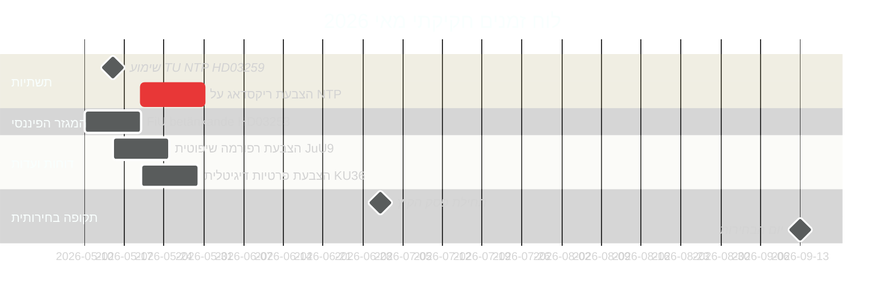

<!-- dir: rtl -->
# שוודיה במאי 2026: תשתיות, שלטון החוק ומיצוב בחירותי במרוץ החקיקתי האחרון

**Author**: James Pether Sörling  
**Date**: 2026-04-30  
**Classification**: PUBLIC  
**Confidence**: HIGH [B2]  
**Analysis depth**: standard  

## 🎯 תמצית מנהלים

מאי 2026 הוא החודש החקיקתי המלא האחרון של קואליציית טידו לפני בחירות הריקסדאג בספטמבר 2026. שלושה אבני דרך חקיקתיות דומיננטיות: הצבעת הריקסדאג על תוכנית התשתיות הלאומית של 970 מיליארד כתר שוודי (HD03259), השלמת טרנספוזיציית הרגולציה הבנקאית האירופית (HD03253), ועיבוד מזורז של דוחות ועדות בנושאי פרטיות דיגיטלית, תחרות ורפורמה שיפוטית. 11 הצעות האופוזיציה מה-30 באפריל — הכוללות סיוע לאוקראינה, דיור, בטיחות בעבודה, בריאות נפשית ורווחת בעלי חיים — מסמנות אסטרטגיית בידול טרום-בחירות. הפוליטיקה השוודית במאי 2026 מעוצבת על ידי מאמץ הממשלה לגבש את נרטיב הירושה שלה ונסיון האופוזיציה להגדיר את אג'נדת הקמפיין הבחירותי.

## 🧭 3 החלטות שהאינפורמציה הזו תומכת בהן

1. **ניתוח בחירותי**: אילו תוצאות חקיקתיות במאי 2026 ישפיעו ביותר על תפיסת הבוחרים את מאזן הממשל של קואליציית טידו לפני ספטמבר?
2. **מעקב מדיניות**: אילו דוחות ועדות והצעות מחייבים מעקב דרך הצבעה בריקסדאג להערכת סיכוני יישום?
3. **עסקים וחברה אזרחית**: אילו שינויים רגולטוריים (בנקאות, תחרות, דיור, בטיחות בעבודה) מחייבים מעורבות מיידית של בעלי עניין במאי?

## קריאה של 60 שניות

- **ירושת תשתיות (HD03259 [A2])**: תוכנית NTP 2026–2037 בסך 970 מיליארד כתר מגיעה להצבעה סופית בריקסדאג במאי. חשמול מסילות הברזל, קישוריות נורלאנד ומסדרונות מטען בינלאומיים מסגירים את תביעת ירושת האקלים-תעשיה של הממשלה. לוח הזמנים של שימועי ועדת TU הוא המדד המוביל הראשון.
- **רגולציה בנקאית (HD03253 [B2])**: טרנספוזיציה של EU CRR3/באזל III הושלמה דרך בטנקנדה של FiU — מגדיר דרישות הון לבנקים שוודיים בעת דאגות ממבחני הלחץ של EBA עבור מוסדות בגודל בינוני ב-EU.
- **הסלמת חוק וסדר (HD03252 [B2])**: הגבלת ביטוח לאומי לנידונים — חלק מתוכנית טידו המסלימה של קישור צדק-ביטוח לאומי (ראו HC03202, HC03201) המכוונת לבוחרים נדנדה עם פשיעה כנושא בחירות מוביל.
- **פרטיות דיגיטלית (HD01KU36 [B2])**: 17 שיפורי KU למסגרות יושרה דיגיטלית מגדירים את אג'נדת יישום חוק ה-AI לממשלה שלאחר הבחירות.
- **רפורמה שיפוטית (HD01JuU9 [B2])**: חבילת יעילות פרוצדורלית של JuU לטיפול בפיגורי עיבוד; יעד יישום 2027.
- **חלל ומחקר (HD10461 [B3])**: פער מימוני של ESA נחשף דרך שאילתת בין-שורות — שוודיה מסתכנת באובדן השתתפות בתוכנית החלל האירופית ברגע של חשיבות מוגברת של תשתיות dual-use למיצוב ב-NATO.
- **גישה לדיור (HD11774 [C2])**: הצעת ערבות אשראי של האופוזיציה מסמנת גירעון דיור ציבורי כנושא בחירותי.

## מדד מוביל ראשי

**2026-05-15**: TU מודיעה על לוח זמנים של שימוע ציבורי להצבעת NTP HD03259 — אם מאושר לסוף מאי, נרטיב ירושת התשתיות של הממשלה נעול לפני הפסקת הקיץ. דחייה לסתיו מסתכנת בהתנגשות עם חלון הקמפיין הבחירותי.

## הערכת אמינות

- לוח זמנים הצבעת NTP תשתיות: HIGH [B2] — מבוסס על תאריך הגשת HD03259 ולוח ועדות
- מסלול בחירותי: MEDIUM-HIGH [B2] — מבוסס על מגמת סקרים + דפוס חקיקתי
- תחזיות כלכליות של קרן המטבע: MEDIUM [C2] — חילוץ ישיר מקרן המטבע לא זמין; נעשה שימוש בגרסת WEO אפריל 2026 מהמטמון

<!-- source-sha: 1f8ac3fadc3c7198b50f9e6519083702a0185cd8 -->
