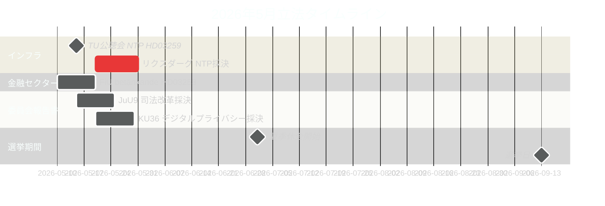

# スウェーデン2026年5月：最終立法スプリントにおけるインフラ、法の支配、選挙ポジショニング

**Author**: James Pether Sörling  
**Date**: 2026-04-30  
**Classification**: PUBLIC  
**Confidence**: HIGH [B2]  
**Analysis depth**: standard  

## 🎯 要点

2026年5月は、2026年9月のリクスダーグ選挙前のティドー連合最後の完全な立法月である。3つの立法マイルストーンが支配的だ：9,700億スウェーデンクローナの国家交通インフラ計画（HD03259）に関するリクスダーグ採決、EU銀行規制の国内法化の完了（HD03253）、デジタルプライバシー、競争、司法改革に関する委員会報告書の加速処理。4月30日の野党11件の動議（ウクライナ支援、住宅、労働安全、メンタルヘルス、動物福祉を含む）は、選挙前の差別化戦略を示している。2026年5月のスウェーデン政治は、政府のレガシー物語の固定化への取り組みと、野党の選挙キャンペーン議題の定義への試みによって形成されている。

## 🧭 このブリーフィングが支援する3つの意思決定

1. **選挙分析**：2026年5月のどの立法成果が、9月前のティドー連合のガバナンス実績に対する有権者の認識に最も影響するか？
2. **政策追跡**：実施リスクを評価するためにリクスダーグ採決を通じて追跡が必要な委員会報告書および法案はどれか？
3. **ビジネスおよび市民社会**：5月に規制当局の利害関係者との即時エンゲージメントが必要な規制変更（銀行、競争、住宅、労働安全）はどれか？

## 60秒で読む

- **インフラのレガシー（HD03259 [A2]）**：9,700億クローナのNTP 2026–2037が5月に最終リクスダーグ採決を迎える。鉄道電化、ノルランド接続性、国際貨物回廊が政府の産業・気候レガシー主張を形成する。TU委員会の公聴会スケジュールが最初の先行指標だ。
- **銀行規制（HD03253 [B2]）**：EU CRR3/バーゼルIIIの国内法化がFiU betänkandeを通じて完了——中規模EU機関に対するEBAのストレステスト懸念の時期に、スウェーデンの銀行に対する自己資本要件を確定する。
- **治安秩序の激化（HD03252 [B2]）**：有罪判決者への社会保障制限——犯罪を上位3つの選挙テーマとするスイング有権者をターゲットとするティドー連合の司法・社会保障連携プログラムの一環（HC03202、HC03201参照）。
- **デジタルプライバシー（HD01KU36 [B2]）**：デジタル誠実性フレームワークへのKUの17の改善が、選挙後政府のAI法実施議題を設定する。
- **司法改革（HD01JuU9 [B2]）**：処理積滞を対象とするJuUの手続き効率化パッケージ；実施目標2027年。
- **宇宙・研究（HD10461 [B3]）**：質問による欧州宇宙機関の資金ギャップの露呈——スウェーデンは、NATO配置に対するデュアルユースインフラの重要性が高まる時期に、欧州宇宙プログラムへの参加を失うリスクがある。
- **住宅アクセス（HD11774 [C2]）**：野党の信用保証動議は、社会住宅不足を選挙問題として示唆している。

## 主要先行指標

**2026-05-15**：TUがHD03259 NTP採決の公聴会スケジュールを発表——5月末に確認されれば、政府のインフラレガシー物語は夏季休会前に固定される。秋への延期は選挙キャンペーン期間と重なるリスクがある。

## 信頼性評価

- インフラNTP採決タイムライン：HIGH [B2] — HD03259提出日および委員会スケジュールに基づく
- 選挙軌跡：MEDIUM-HIGH [B2] — 世論調査トレンド＋立法パターンに基づく
- IMF経済見通し：MEDIUM [C2] — IMF直接取得不可；キャッシュから2026年4月WEOビンテージを使用

<!-- source-sha: 1f8ac3fadc3c7198b50f9e6519083702a0185cd8 -->
