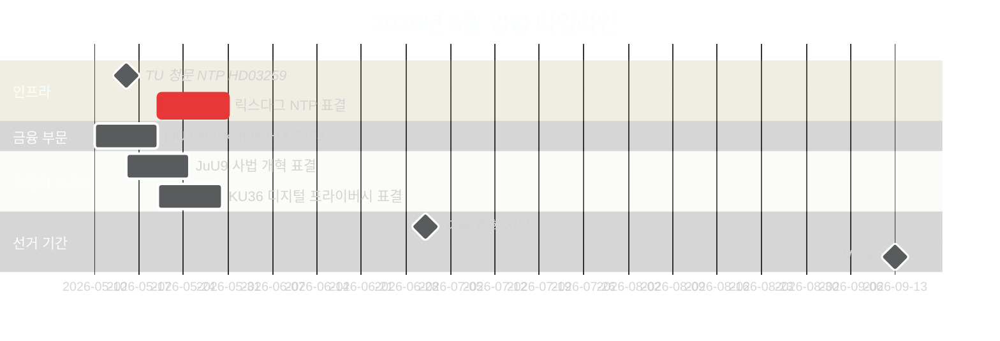

# 스웨덴 2026년 5월: 최종 입법 스프린트에서의 인프라, 법치주의 및 선거 포지셔닝

**Author**: James Pether Sörling  
**Date**: 2026-04-30  
**Classification**: PUBLIC  
**Confidence**: HIGH [B2]  
**Analysis depth**: standard  

## 🎯 핵심 요약

2026년 5월은 2026년 9월 릭스다그 선거 전 티도 연립의 마지막 완전한 입법 월이다. 세 가지 입법 이정표가 지배적이다: 9,700억 스웨덴 크로나 국가 교통 인프라 계획(HD03259)에 대한 릭스다그 표결, EU 은행 규제 국내법화 완료(HD03253), 디지털 프라이버시·경쟁·사법 개혁에 관한 위원회 보고서의 가속 처리. 4월 30일의 야당 11개 동의안 — 우크라이나 지원, 주택, 노동 안전, 정신 건강, 동물 복지 포함 — 은 선거 전 차별화 전략을 시사한다. 2026년 5월 스웨덴 정치는 정부의 레거시 서사 고착화 노력과 야당의 선거 캠페인 의제 정의 시도로 형성된다.

## 🧭 이 브리핑이 지원하는 3가지 의사결정

1. **선거 분석**: 2026년 5월의 어떤 입법 결과가 9월 전 티도 연립의 거버넌스 실적에 대한 유권자 인식에 가장 영향을 미칠 것인가?
2. **정책 추적**: 실행 위험을 평가하기 위해 릭스다그 표결을 통해 추적해야 하는 위원회 보고서와 법안은 무엇인가?
3. **기업 및 시민 사회**: 5월에 즉각적인 이해관계자 참여가 필요한 규제 변경 사항(은행, 경쟁, 주택, 노동 안전)은 무엇인가?

## 60초 읽기

- **인프라 레거시(HD03259 [A2])**: 9,700억 크로나 NTP 2026–2037이 5월 릭스다그 최종 표결에 도달한다. 철도 전철화, 노를란드 연결성, 국제 화물 회랑이 정부의 산업-기후 레거시 주장을 형성한다. TU 위원회 청문 일정이 첫 번째 선행 지표다.
- **은행 규제(HD03253 [B2])**: EU CRR3/바젤 III 국내법화가 FiU betänkande를 통해 완료됨 — EU 중규모 기관에 대한 EBA 스트레스 테스트 우려 시기에 스웨덴 은행의 자본 요건을 확정한다.
- **법질서 확대(HD03252 [B2])**: 유죄 판결자에 대한 사회 보장 제한 — 범죄를 상위 3개 선거 이슈로 삼는 스윙 유권자를 대상으로 하는 티도 연립의 사법-사회 보장 연계 프로그램 일부(HC03202, HC03201 참조).
- **디지털 프라이버시(HD01KU36 [B2])**: 디지털 무결성 프레임워크에 대한 KU의 17개 개선 사항이 선거 후 정부를 위한 AI 법 실행 의제를 설정한다.
- **사법 개혁(HD01JuU9 [B2])**: 처리 적체 해소를 위한 JuU 절차 효율성 패키지; 실행 목표 2027년.
- **우주 및 연구(HD10461 [B3])**: 대정부 질문을 통해 드러난 ESA 자금 격차 — NATO 포지셔닝을 위한 이중 용도 인프라의 중요성이 높아지는 시기에 스웨덴이 유럽 우주 프로그램 참여를 잃을 위험에 처해 있다.
- **주택 접근성(HD11774 [C2])**: 야당의 신용 보증 동의안은 사회 주택 부족을 선거 이슈로 시사한다.

## 주요 선행 지표

**2026-05-15**: TU가 HD03259 NTP 표결을 위한 공청회 일정을 발표함 — 5월 말로 확인되면 정부의 인프라 레거시 서사가 여름 휴회 전에 고착된다. 가을로 연기되면 선거 캠페인 기간과 겹칠 위험이 있다.

## 신뢰도 평가

- 인프라 NTP 표결 타임라인: HIGH [B2] — HD03259 제출 날짜와 위원회 일정에 근거
- 선거 궤적: MEDIUM-HIGH [B2] — 여론 조사 트렌드 + 입법 패턴에 근거
- IMF 경제 전망: MEDIUM [C2] — IMF 직접 추출 불가; 캐시에서 2026년 4월 WEO 빈티지 사용

<!-- source-sha: 1f8ac3fadc3c7198b50f9e6519083702a0185cd8 -->
