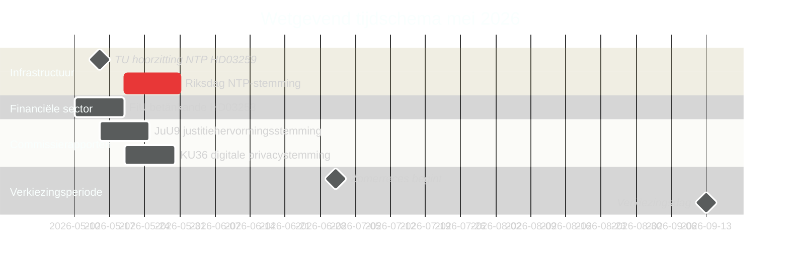

# Zweden in mei 2026: Infrastructuur, rechtsstaat en electorale positionering in de laatste wetgevende sprint

**Author**: James Pether Sörling  
**Date**: 2026-04-30  
**Classification**: PUBLIC  
**Confidence**: HIGH [B2]  
**Analysis depth**: standard  

## 🎯 BLUF

Mei 2026 is de laatste volledige wetgevingsmaand van de Tidöalliansen voor de Riksdag-verkiezingen van september 2026. Drie wetgevingsmijlpalen domineren: de Riksdag-stemming over het nationaal transportinfrastructuurplan van 970 miljard SEK (HD03259), de voltooiing van de EU-bankreguleringstransposities (HD03253) en versnelde commissieverwerking over digitale privacy, concurrentie en justitiële hervorming. De 11 oppositiemoties van 30 april — over Oekraïne-hulp, huisvesting, arbeidsveiligheid, geestelijke gezondheid en dierenwelzijn — signaleren een strategie voor pre-electorale profilering. De Zweedse politiek in mei 2026 wordt bepaald door de inspanning van de regering om haar erfenisnarratief te consolideren en de poging van de oppositie om de campagneagenda te definiëren.

## 🧭 3 beslissingen die dit briefing ondersteunt

1. **Verkiezingsanalyse**: Welke wetgevingsuitkomsten in mei 2026 zullen de perceptie van kiezers over het bestuursrecord van de Tidöalliansen vóór september het meest beïnvloeden?
2. **Beleidsopvolging**: Welke commissierapporten en proposities vereisen opvolging via Riksdag-stemming om implementatierisico's te beoordelen?
3. **Bedrijfsleven en maatschappelijk middenveld**: Welke regelgevingswijzigingen (bankwezen, concurrentie, huisvesting, arbeidsveiligheid) vereisen onmiddellijke betrokkenheid van stakeholders in mei?

## Lezen in 60 seconden

- **Infrastructuurerfenis (HD03259 [A2])**: Het NTP 970 miljard SEK 2026–2037 komt in mei voor de eindstemming in de Riksdag. Spoorwegelectrificatie, Norrland-connectiviteit en internationale vrachtcorridors omkaderen de industrieel-klimatologische erfenisclaim van de regering. Het hoorzittingsschema van de TU-commissie is de eerste voorlopende indicator.
- **Bankregulering (HD03253 [B2])**: EU CRR3/Basel III-transpositie afgerond via FiU betänkande — stelt kapitaaleisen voor Zweedse banken vast op een moment van EBA-stresstestbezorgdheid voor middelgrote EU-instellingen.
- **Wet en orde-escalatie (HD03252 [B2])**: Sociale zekerheidsbeperking voor veroordeelden — onderdeel van een escalerend Tidöalliansen justitie-sociale zekerheid nexusprogramma (zie HC03202, HC03201) gericht op wisselkiezers met misdaad als top-3 verkiezingsthema.
- **Digitale privacy (HD01KU36 [B2])**: KU's 17 verbeteringen aan digitale integriteitskaders stellen de AI Act-implementatieagenda in voor de post-verkiezingsregering.
- **Justitiële hervorming (HD01JuU9 [B2])**: JuU procedureel efficiëntiepakket gericht op verwerkingsachterstanden; implementatiedoelstelling 2027.
- **Ruimtevaart en onderzoek (HD10461 [B3])**: ESA-financieringskloof blootgelegd door interpellatie — Zweden riskeert verlies van deelname aan het Europese ruimtevaartprogramma op een moment van verhoogd belang van dual-use infrastructuur voor NAVO-positionering.
- **Toegang tot huisvesting (HD11774 [C2])**: Oppositie kredietgarantiemotie signaleert sociaal huisvestingstekort als verkiezingsprobleem.

## Leidende voorlopende indicator

**2026-05-15**: TU kondigt publiek hoorzittingsschema aan voor HD03259 NTP-stemming — indien bevestigd voor eind mei, is het infrastructuurerfenisnarratief van de regering vastgelegd vóór het zomerreces. Een vertraging naar het najaar riskeert in het campagnetermijn te vallen.

## Betrouwbaarheidsbeoordeling

- Infrastructuur NTP-stemmingtijdlijn: HIGH [B2] — gebaseerd op HD03259-tabelleringsdatum en commissieschema
- Electorale trajectorie: MEDIUM-HIGH [B2] — gebaseerd op peilingtrend + wetgevingspatroon
- IMF economische prognoses: MEDIUM [C2] — directe IMF-extractie niet beschikbaar; WEO apr.-2026-vintage gebruikt uit cache

<!-- source-sha: 1f8ac3fadc3c7198b50f9e6519083702a0185cd8 -->
