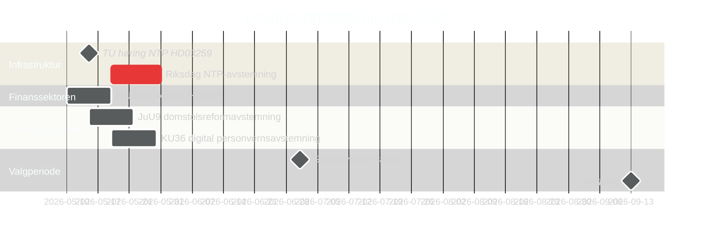

# Sverige i mai 2026: Infrastruktur, rettssikkerhet og valgposisjonering i den siste lovgivningsspurten

**Author**: James Pether Sörling  
**Date**: 2026-04-30  
**Classification**: PUBLIC  
**Confidence**: HIGH [B2]  
**Analysis depth**: standard  

## 🎯 BLUF

Mai 2026 er Tidöalliansens siste fullstendige lovgivningsmåned før Riksdag-valget i september 2026. Tre lovgivningsmilepæler dominerer: Riksdag-avstemningen om den nasjonale transportinfrastrukturplanen på 970 milliarder SEK (HD03259), ferdigstillelsen av EU-bankregulerings-transposisjonen (HD03253) og akselerert utvalgsbehandling innen digital personvern, konkurranse og domstolsreform. Opposisjonens 11 motioner den 30. april — som spenner over Ukraina-støtte, boliger, arbeidssikkerhet, psykisk helse og dyrevelferd — signaliserer en strategi for pre-valg-differensiering. Svensk politikk i mai 2026 er definert av regjeringens innsats for å befeste sitt arvsnarrativ og opposisjonens bud på å definere valgkampanjens agenda.

## 🧭 3 beslutninger dette briefet støtter

1. **Valganalyse**: Hvilke lovgivningsresultater i mai 2026 vil mest forme velgernes oppfatning av Tidöalliansens styringsrekord foran september?
2. **Politikksporing**: Hvilke utvalgsrapporter og proposisjoner krever overvåking gjennom Riksdag-avstemning for å vurdere implementeringsrisiko?
3. **Næringsliv og sivilsamfunn**: Hvilke regelendringer (bank, konkurranse, bolig, arbeidssikkerhet) krever umiddelbar interessentengasjement i mai?

## 60-sekunders lesning

- **Infrastrukturarv (HD03259 [A2])**: 970 milliarder SEK NTP 2026–2037 kommer til endelig Riksdag-avstemning i mai. Jernbaneelektrifisering, Norrland-forbindelser og internasjonale godskorridorer rammesetter regjeringens industri-klimaarvsanspråk. TU-utvalgets høringsskjema er den første ledende indikatoren.
- **Bankregulering (HD03253 [B2])**: EU CRR3/Basel III-transposisjon fullført via FiU betänkande — setter kapitalkrav for svenske banker i et øyeblikk av EBA-stresstestbekymring for mellomstore EU-institusjoner.
- **Lov og orden-eskalering (HD03252 [B2])**: Sosialforsikringsrestriksjon for dømte — del av et eskalerende Tidöalliansen rettferdighet-sosialpolitikk-nexusprogram (se HC03202, HC03201) som retter seg mot svingvelgere med kriminalitet som topp-3-valgsak.
- **Digitalt personvern (HD01KU36 [B2])**: KUs 17 forbedringer av digitale integritetssystemer setter AI Act-implementeringsagendaen for post-valgregjering.
- **Domstolsreform (HD01JuU9 [B2])**: JuU prosedyreeffektivitetspakke rettet mot saksbehandlingsbalanse; implementeringsmål 2027.
- **Rom og forskning (HD10461 [B3])**: ESA-finansieringsgap eksponert av interpellasjon — Sverige risikerer å miste deltakelse i det europeiske romprogrammet i et øyeblikk av økt dual-use-infrastrukturvikt for NATO-posisjonering.
- **Boligenhet (HD11774 [C2])**: Opposisjonens kredittgarantimosjon signaliserer sosialt boliggap som valgsak.

## Ledende fremover-indikator

**2026-05-15**: TU kunngjør offentlig høringsskjema for HD03259 NTP-avstemning — hvis bekreftet for slutten av mai, er regjeringens infrastrukturarvsnarrativ låst inn før sommerferien. Forsinkelse til høsten risikerer å falle inn i valgkampanjevinduet.

## Konfidensvurdering

- Infrastruktur NTP-avstemningsdato: HIGH [B2] — basert på HD03259-tabellert dato og utvalgsplan
- Valgbane: MEDIUM-HIGH [B2] — basert på meningsmålingstrend + lovgivningsmønster
- IMF-økonomiske prognoser: MEDIUM [C2] — IMF direkte henting utilgjengelig; WEO-årgangen apr-2026 brukt fra cache

<!-- source-sha: 1f8ac3fadc3c7198b50f9e6519083702a0185cd8 -->
