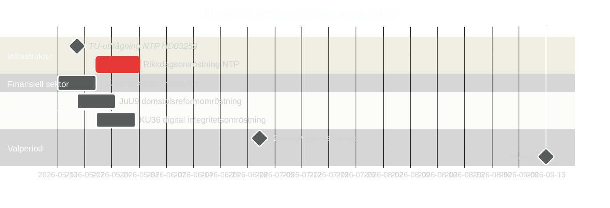

# Sverige i maj 2026: Infrastruktur, rättssäkerhet och valpositionering i sista lagstiftarspurten

**Author**: James Pether Sörling  
**Date**: 2026-04-30  
**Classification**: PUBLIC  
**Confidence**: HIGH [B2]  
**Analysis depth**: standard  

## 🎯 BLUF

Maj 2026 är Tidöalliansens sista fullständiga lagstiftarmånad före riksdagsvalet i september 2026. Tre lagstiftningsmilstolpar dominerar: riksdagsomröstningen om det nationella transportinfrastrukturprogrammet på 970 miljarder kronor (HD03259), slutförandet av transponeringen av EU:s bankregleringar (HD03253) och accelererad behandling av utskottsbetänkanden inom digital integritet, konkurrens och domstolsreform. Oppositionens 11 motioner den 30 april — inom områdena Ukraine-stöd, bostäder, arbetsmiljö, psykisk hälsa och djurvälfärd — signalerar en strategi för valskillnadsmarkering. Svensk politik i maj 2026 präglas av regeringens ansträngningar att befästa sitt arvsnarrativ och oppositionens strävan att definiera valkampanjens agenda.

## 🧭 3 Beslut som detta briefing stödjer

1. **Valanalys**: Vilka lagstiftningsresultat i maj 2026 kommer mest att påverka väljarnas syn på Tidöalliansens styrningsrekord inför september?
2. **Policybevakning**: Vilka utskottsbetänkanden och propositioner behöver bevakas genom riksdagsomröstning för att bedöma implementeringsrisker?
3. **Näringsliv och civilsamhälle**: Vilka regeländringar (banksektor, konkurrens, bostäder, arbetsmiljö) kräver omedelbart intressentengagemang i maj?

## 60-sekunders läsning

- **Infrastrukturarvet (HD03259 [A2])**: NTP 2026–2037 på 970 miljarder kronor kommer till slutlig riksdagsomröstning i maj. Järnvägselektrifiering, Norrlandsförbindelser och internationella godsstråk utgör regeringens arvsanspråk på industri och klimat. TU:s utfrågningsschema är den första ledande indikatorn.
- **Bankreglering (HD03253 [B2])**: EU:s CRR3/Basel III-transponering klar via FiU-betänkande — fastställer kapitalkrav för svenska banker vid ett tillfälle av EBA-stresstestoro för medelstora EU-institutioner.
- **Lag och ordning-eskalering (HD03252 [B2])**: Socialförsäkringsrestriktion för dömda — del av ett eskalerande Tidöalliansen rättvisa-socialpolitik-nexusprogram (se HC03202, HC03201) som riktar sig till svängväljare med brottslighet som topp-3 valfråga.
- **Digital integritet (HD01KU36 [B2])**: KU:s 17 förbättringar av digitala integritetsramverk sätter AI Act-implementeringsagenda för post-valregeringen.
- **Domstolsreform (HD01JuU9 [B2])**: JuU processuellt effektivitetspaket som riktar sig mot balans i ärendehandläggning; implementeringsmål 2027.
- **Rymd och forskning (HD10461 [B3])**: ESA-finansieringsgap exponerat av interpellation — Sverige riskerar att förlora deltagande i det europeiska rymdprogrammet i ett läge med ökad dual-use-infrastrukturviktighet för NATO-positionering.
- **Bostadsaccess (HD11774 [C2])**: Oppositionens kreditgarantimotion signalerar socialt bostadsgap som valfråga.

## Ledande framåtindikator

**2026-05-15**: TU meddelar offentlig utfrågningsplan för HD03259 NTP-omröstning — om bekräftad för slutet av maj är regeringens infrastrukturarvsnarrativ låst innan sommaruppehållet. Fördröjning till hösten riskerar att sammanfalla med valkampanjfönstret.

## Konfidenssbedömning

- NTP-omröstningens timing infrastruktur: HIGH [B2] — baserat på HD03259:s tabelleringsdatum och utskottsschemat
- Valbanskurva: MEDIUM-HIGH [B2] — baserat på opinionsundersökningstrender + lagstiftningsmönster
- IMF ekonomiska prognoser: MEDIUM [C2] — IMF direkthämtning ej tillgänglig; WEO-årgång april 2026 använd från cache

<!-- source-sha: 1f8ac3fadc3c7198b50f9e6519083702a0185cd8 -->
