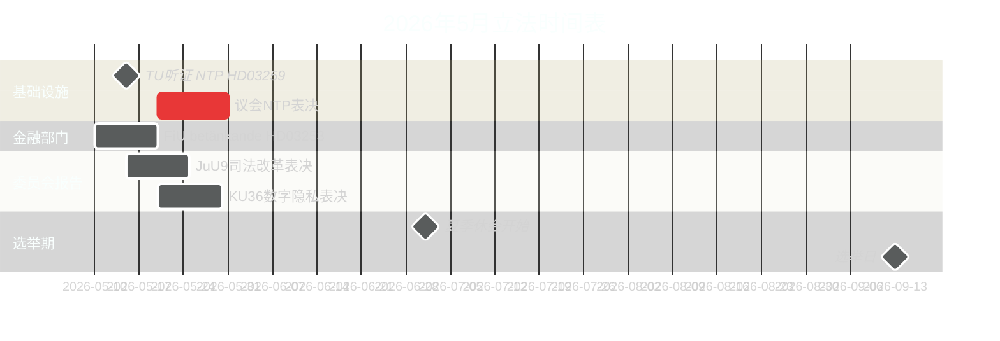

# 2026年5月的瑞典：最终立法冲刺中的基础设施、法治与选举定位

**Author**: James Pether Sörling  
**Date**: 2026-04-30  
**Classification**: PUBLIC  
**Confidence**: HIGH [B2]  
**Analysis depth**: standard  

## 🎯 核心要点

2026年5月是蒂德联盟在2026年9月议会选举前的最后一个完整立法月。三个立法里程碑占主导地位：议会就价值9700亿瑞典克朗的国家交通基础设施计划（HD03259）进行表决、欧盟银行监管移植完成（HD03253），以及委员会加速处理数字隐私、竞争和司法改革报告。4月30日的11项反对派动议——涵盖乌克兰援助、住房、劳动安全、心理健康和动物福利——标志着一种选前差异化策略。2026年5月的瑞典政治由政府巩固遗产叙事的努力与反对派定义竞选议程的尝试所塑造。

## 🧭 本简报支持的3项决策

1. **选举分析**：2026年5月哪些立法成果将最深刻影响选民对蒂德联盟在9月前治理记录的认知？
2. **政策追踪**：哪些委员会报告和议案需要通过议会表决来追踪，以评估实施风险？
3. **企业与公民社会**：哪些监管变化（银行业、竞争、住房、劳动安全）需要在5月立即开展利益相关者参与？

## 60秒阅读

- **基础设施遗产（HD03259 [A2]）**：9700亿克朗NTP 2026–2037将于5月进行议会最终表决。铁路电气化、诺尔兰连通性和国际货运走廊构成政府工业-气候遗产主张的框架。交通基础设施委员会（TU）的听证日程是第一个领先指标。
- **银行监管（HD03253 [B2]）**：通过FiU betänkande完成欧盟CRR3/巴塞尔III移植——在欧洲银行管理局（EBA）对中型欧盟机构压力测试问题存在担忧之际，确立瑞典银行的资本要求。
- **法律与秩序升级（HD03252 [B2]）**：对被定罪者的社会保障限制——是蒂德联盟以犯罪为选举主题前三名、针对摇摆选民的司法-社会保障关联计划（参见HC03202、HC03201）的一部分。
- **数字隐私（HD01KU36 [B2]）**：KU对数字诚信框架的17项改进为选后政府设定了人工智能法实施议程。
- **司法改革（HD01JuU9 [B2]）**：JuU针对案件积压的程序效率套餐；实施目标2027年。
- **太空与研究（HD10461 [B3]）**：通过质询暴露的欧洲航天局资金缺口——在双用途基础设施对北约定位重要性日益上升的时刻，瑞典面临失去欧洲太空计划参与的风险。
- **住房可及性（HD11774 [C2]）**：反对派信用担保动议将社会住房缺口标记为选举议题。

## 主要领先指标

**2026-05-15**：TU公布HD03259 NTP表决的公开听证日程——若确认在5月底前，政府的基础设施遗产叙事在夏季休会前得以锁定。推迟至秋季则有与选举竞选期窗口重叠的风险。

## 置信度评估

- 基础设施NTP表决时间表：HIGH [B2] — 基于HD03259提交日期和委员会日程
- 选举轨迹：MEDIUM-HIGH [B2] — 基于民调趋势+立法模式
- IMF经济预测：MEDIUM [C2] — IMF直接提取不可用；使用缓存中的2026年4月WEO版本

<!-- source-sha: 1f8ac3fadc3c7198b50f9e6519083702a0185cd8 -->
