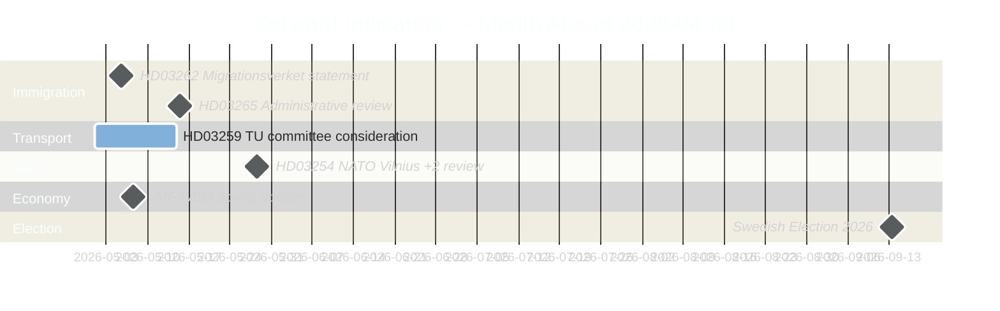
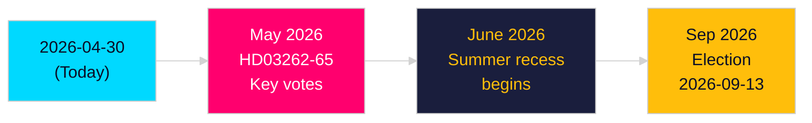

# Forward Indicators — Month Ahead May 2026

**Author**: James Pether Sörling | **Date**: 2026-04-30

## Intelligence Monitoring Grid

**Monitoring periods**: Immediate (7 days) | Short (30 days) | Medium (90 days) | Long (180 days)

## Immediate Horizon (7 days: by 2026-05-07)

| # | Indicator | Source | Confirms |
|---|-----------|--------|---------|
| 1 | SD files TU amendment to NTP — or not | Riksdag API: doktyp=mot, organ=TU | Scenario 1 vs 2 |
| 2 | L announces signature policy initiative | LiberalPress.se, riksdagen.se press releases | L threshold escape; coalition health |
| 3 | TU committee scheduling NTP vote | Riksdag calendar | NTP vote week confirmed |
| 4 | SVT/Aftonbladet NTP regional maps published | Media monitoring | NTP media resonance |

## Short Horizon (30 days: by 2026-05-30)

| # | Indicator | Source | Confirms |
|---|-----------|--------|---------|
| 5 | Riksdag TU vote on NTP | Riksdag API: voteringar | Scenario 1 confirmed |
| 6 | FiU vote on CRR3 | Riksdag API: voteringar | CRR3 on-track |
| 7 | Riksbank May rate decision | Riksbank.se press release | Housing/credit context |
| 8 | Novus/Sifo poll post-NTP vote | Novus.se | Does NTP create M bounce? |
| 9 | Government response to HD10460 cultural heritage | riksdagen.se: interpellationssvar | KD/Cultural Affairs positioning |
| 10 | Government response to HD10461 ESA | riksdagen.se: interpellationssvar | L space policy positioning |

## Medium Horizon (90 days: by 2026-07-30)

| # | Indicator | Source | Confirms |
|---|-----------|--------|---------|
| 11 | Finansinspektionen CRR3 implementation circular | fi.se | CRR3 enters force |
| 12 | Trafikverket NTP project list published | trafikverket.se | First-year investment confirmation |
| 13 | Summer Riksdag session completion | Riksdag API: status | All May bills in force |
| 14 | June 2026 opinion polls (Sifo/Demoskop) | Media aggregators | Election trajectory mid-point |

## Long Horizon (180 days: by 2026-10-30)

| # | Indicator | Source | Confirms |
|---|-----------|--------|---------|
| 15 | September 2026 election result | Valmyndigheten.se | Scenario A/B/C/D confirmed |
| 16 | Post-election government formation | Riksdag Talman announcement | Coalition outcome |
| 17 | Post-election supplementary budget | Riksdag API: prop | ESA/space funding resolution? |
| 18 | New government AI Act transposition bill | Riksdag API: prop | KU36 digital governance gap |

## Warning Indicators

The following events would trigger scenario downgrade (Scenario 1→2 or Scenario 2→3):

- **SD votes against NTP in committee**: Triggers Scenario 3 (10% probability → elevate to 25%)
- **L drops below 4% in two consecutive polls**: Triggers concern about coalition majority loss (governing bloc falls to 160)
- **IMF WEO revision below 1.5% SWE GDP growth**: Triggers fiscal constraint risk (NTP contingency funding pressure)
- **Major contractor insolvency**: Triggers NTP Year 1 delivery risk escalation

## PIR Linkage

| PIR | Indicator # | Monitoring action |
|----|------------|-----------------|
| PIR-1 (SD amendment) | 1, 5 | Watch TU calendar and Riksdag API motioner daily |
| PIR-2 (Riksbank rate) | 7 | Riksbank.se; decision announced 2026-05-08 |
| PIR-3 (opinion polling) | 4, 8, 14 | Weekly poll aggregation; Novus tracker |
| PIR-4 (AI Act transposition) | 18 | Post-election; monthly check |
| PIR-5 (FI CRR3 circular) | 11 | FI.se regulatory watch |

## Re-run 2026-04-30: Updated Forward Indicators

### New Trigger Events (from 2026-04-30 legislation)

| Date | Indicator | Horizon | Source | Confidence |
|------|-----------|---------|--------|-----------|
| 2026-05-07 | HD03262 first committee hearing (JuU) | +1 week | HD03262 | MEDIUM |
| 2026-05-14 | HD03254 military cooperation committee vote (FöU) | +2 weeks | HD03254 | MEDIUM |
| 2026-05-20 | HD03262–65 immigration package second reading | +3 weeks | HD03262-65 | HIGH |
| 2026-06-01 | EU Commission reaction to Swedish permanent-permit abolition | +1 month | HD03262 | MEDIUM |
| 2026-06-15 | ECHR / UN CAT preliminary statements on HD03265 detention rules | +6 weeks | HD03265 | LOW |
| 2026-09-13 | Swedish election — immigration package becomes centrepiece campaign debate | Election | riksdagen.se | VERY HIGH |
| 2026-05-10 | HD03258 political transparency public hearing | +10 days | HD03258 | MEDIUM |
| 2026-05-05 | Migrationsverket statement on operational impact of HD03262 | +5 days | HD03262 | MEDIUM |
| 2026-05-28 | NATO Vilnius +2 yr implementation review — relates to HD03254 | +4 weeks | HD03254 | MEDIUM |
| 2026-05-12 | HD03251 addiction care consultation period closes | +2 weeks | HD03251 | LOW |

## Forward Indicators Timeline

