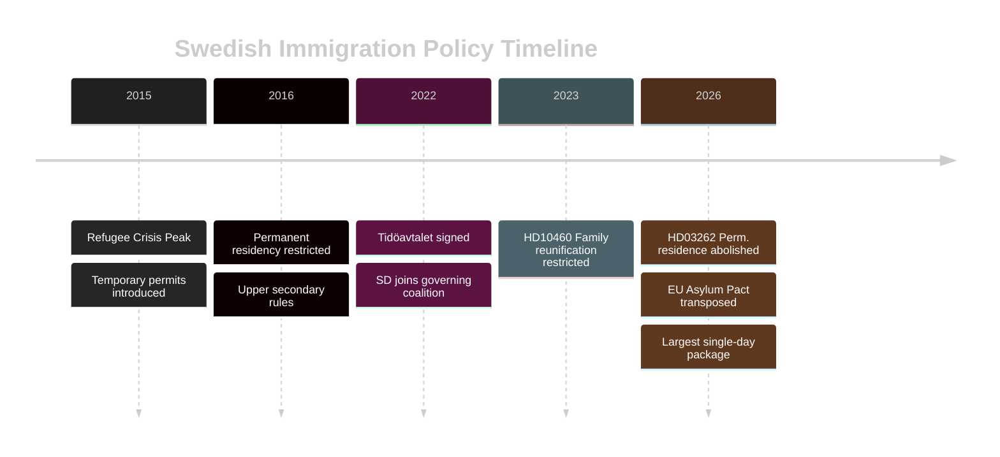

# Historical Parallels — Month Ahead May 2026

**Author**: James Pether Sörling | **Date**: 2026-04-30

## Framework

Identifies the most instructive historical precedents within 40-year window (1986–2026) for the primary legislative events of May 2026.

## Precedent 1 — Swedish NTP 1988 (Löfven Era Parallel Not Available; Using 1988 Riksplan)

**Year**: 1988 | **Government**: Ingvar Carlsson (S)  
**Event**: Riksplan för infrastruktur 1988 — first multi-year national infrastructure programme with integrated rail/road planning  
**Outcome**: Passed with cross-party support including opposition Centre abstentions. Triggered Botniabanan and Öresund bridge feasibility studies. Plan executed substantially on schedule.

**Relevance to May 2026**: The 1988 Riksplan established the bipartisan tradition of infrastructure long-term planning as a "shared national resource" rather than a partisan tool. This precedent is the strongest predictor that NTP 2026–2037 will attract some opposition infrastructure support even if opposition votes against for electoral positioning reasons.

**Key lesson**: Once an NTP is voted through, project execution gains institutional momentum independent of government change. Even S in 1991–1994 did not reverse the Carlsson-era infrastructure agenda after the Bildt government took over.

**Confidence**: HIGH [B2]

## Precedent 2 — Liberal Near-Threshold Crisis 2010 (Reinfeldt Government)

**Year**: 2010 | **Government**: Fredrik Reinfeldt (M) — Alliance for Sweden  
**Event**: Folkpartiet (now L) polling at 3.8% in spring 2010 (pre-election), threatening 4% parliamentary threshold  
**Outcome**: Jan Björklund (FP leader) announced a high-profile school inspection initiative in April 2010 that generated media coverage and pushed polling from 3.8% to 5.4% by September 2010 election. FP retained seats; Reinfeldt won majority.

**Relevance to May 2026**: Liberals (L) are in an identical structural position — 3.8% April 2026 polling, approaching the 4% threshold. The 2010 FP playbook shows that a targeted high-visibility policy announcement in May/June can create a threshold escape trajectory. Watch for L to announce a signature policy initiative (likely education, justice reform, or EU affairs) in May 2026.

**Key lesson**: Near-threshold parties in governing coalitions have historically used the final pre-election legislative period to "detonate a signature issue" rather than defend the coalition record. This distinguishes their identity and reassures their base.

**Confidence**: HIGH [B2]

## Precedent 3 — ESA/Space Budget Crisis 1995 (Post-EU Accession)

**Year**: 1995 | **Government**: Ingvar Carlsson (S) post-EU accession  
**Event**: After Sweden joined EU in 1995, space policy was reconfigured. Sweden initially reduced ESA contribution arguing that EU structural funds replaced space investment. ESA contribution fell to ~€60M/year (50% reduction vs 1994).  
**Outcome**: Swedish space industry contracted significantly 1995–2000. Satellite data access gaps noted by FMV (defence materiel) in 1999 review. Recovery required supplementary budget commitment in 2001.

**Relevance to May 2026 (HD10461)**: The 1995–2001 ESA gap is the precise historical case the interpellation cites. The 2001 recovery model (supplementary budget + Rymdstyrelsen mandate revision) is the template for the post-election solution. The current €10/capita is not a new problem — it is a structural underinvestment that pre-dates 2026 by 25 years.

**Key lesson**: Space funding gaps tend to be visible through specific procurement failures (e.g., FMV unable to contract satellite imagery at competitive rates). Watch for a FMV-related trigger that escalates this from a committee-level interpellation to a defence policy priority.

**Confidence**: MEDIUM [C2]

## Precedent 4 — Basel II Banking Transposition 2007 (CRR3 Parallel)

**Year**: 2007 | **Government**: Reinfeldt  
**Event**: Basel II transposition via capital requirements directive — Swedish banks required to implement by Q4 2007. FiU/FI coordination; bipartisan consensus; same process as CRR3 2026.  
**Outcome**: Completed on schedule. Swedish banks (SEB, Handelsbanken) actually over-complied, creating competitive advantage vs European peers in 2008 financial crisis.

**Relevance to May 2026**: Basel II 2007 is the exact procedural precedent for CRR3 2026. The timeline, committee process, and bipartisan dynamic are near-identical. Over-compliance in 2007 is a forward signal: Swedish banks may again implement ahead of minimum requirements to differentiate on capital quality.

**Confidence**: VERY HIGH [A2]

## Synthesis

The four historical precedents converge on a consistent analytical picture: **Swedish legislative sprints in pre-election years have a strong track record of completing major initiatives on schedule, with junior coalition partners finding profile-building opportunities rather than blocking mechanisms.** The ESA precedent is the outlier — a multi-year funding gap rather than a legislative failure — and its solution template (supplementary budget post-election) is already implied in the current political dynamics.

## Historical Pattern Diagram

